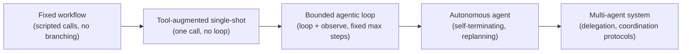

# Agentic AI Philosophy — Generic Characterization

Reference notes on what makes an AI system "agentic" in the generic/industry sense, independent
of any specific workload in this repo. For the workload-specific gap analysis (how the MLPerf
Client SWE Agent scenario measures up against this framework), see
[AGENTIC_WORKFLOW_CHARACTERIZATION.md](AGENTIC_WORKFLOW_CHARACTERIZATION.md).

## 1. The foundational distinction: Workflow vs. Agent

The single most important line in the field (the canonical Anthropic framing):

- **Workflow** — an LLM is called one or more times, but the **control flow (what happens next)
  is predetermined by the developer's code**, not the model. Branching, loop counts, and stopping
  points are fixed in advance.
- **Agent** — the **LLM itself dynamically decides the control flow**: what to do next, whether
  to loop again, whether to stop, whether to change approach — at runtime, based on what it
  observes.

Everything below is really just unpacking *what "the model controls the control flow" requires in
practice*. If the control flow is fixed by a human/script ahead of time, no amount of tool-calling
or clever prompting makes it an agent — it's a workflow that happens to call tools.

## 2. Necessary characteristics (fail any one → it's not a true agent)

| # | Characteristic | What it actually requires |
|---|---|---|
| 1 | **Goal-directed autonomy** | Operates toward an objective across multiple steps without a human approving each individual action |
| 2 | **Closed perceive→reason→act→observe loop** | The *real* result of an action (not a pre-written stand-in) is what gets fed back into the next reasoning step — this is the ReAct core. If the "next input" is fixed regardless of what the action returned, the loop is open, not closed |
| 3 | **Environment grounding via tools/actions** | Can actually change or query external state (files, APIs, a shell, a browser) — not just produce text describing an action |
| 4 | **Dynamic planning & re-planning** | Decomposes the goal into steps *and* can revise that plan when new information contradicts it — a plan fixed at t=0 and never revisited is scripting, not planning |
| 5 | **Self-determined termination** | The agent itself judges "done", "blocked", or "failed" — an externally imposed fixed step/turn count is at best a safety ceiling, never the primary stop signal |
| 6 | **State/memory across steps** | Working context persists and is actually used to inform later decisions (short-term at minimum; long-term/episodic memory for more advanced systems) |
| 7 | **Genuine branch-ability** | Different inputs/observations can lead to materially different action sequences — if the exact same steps happen no matter what the model or environment produces, there's no real agency being exercised, only its appearance |

## 3. Cutting-edge characteristics (2025–2026 state of the art)

These separate real agentic systems from tool-calling demos:

- **Reflection / self-critique loops** — the agent evaluates its own intermediate output against
  the goal (Reflexion-style verbal self-feedback) and revises *before* the human or an external
  grader sees it, not just "try, fail, retry blindly."
- **Verifiable outcome grounding** — success is checked against an objective signal the agent can
  query itself (tests pass, output validates against a schema, a computed diff is non-empty)
  rather than the model's own self-reported confidence. This is the difference between "I believe
  I'm done" and "I confirmed I'm done."
- **Context engineering** — active, deliberate management of what stays in the context window:
  summarization/compaction of old steps, selective retrieval instead of unbounded history growth,
  and delegating sub-tasks to isolate context. Cutting-edge agents manage their memory budget as a
  first-class problem, not an afterthought.
- **RL-trained agentic competence** — frontier models built explicitly for agentic use (o-series,
  extended-thinking Claude, DeepSeek-R1-class models) are post-trained with reinforcement learning
  on multi-step tool-use trajectories against verifiable rewards, not merely supervised-fine-tuned
  to imitate agent transcripts. This is *why* they sustain long horizons and recover from dead ends
  better than a base chat model that's simply prompted to "act like an agent."
- **Sub-agent delegation / recursive agency** — a top-level agent can spawn specialized sub-agents
  for isolated sub-problems and merge their results back, rather than doing everything in one flat
  loop.
- **Bounded autonomy / permission dial** — real agency includes knowing *when to stop and ask*. A
  system that never asks for approval on irreversible or high-stakes actions isn't "more
  agentic" — it's under-governed. The dial between full autonomy and human-in-the-loop approval
  gates is itself a designed property of a mature agentic system, not a compromise of agency.
- **Interruptibility / steerability** — can be redirected mid-task by new input without corrupting
  its state or having to restart from scratch.
- **Inter-agent protocols** — standardized ways for multiple agents to communicate/coordinate
  (tool schemas, message-passing protocols) rather than ad hoc glue code, enabling composition of
  agents built by different parties.

## 4. It's a spectrum, not a binary

Most real production systems deliberately sit in the **B/C** zone with human approval gates on
irreversible actions — that's not a failure to be "fully agentic," it's usually the correct
engineering choice. "More autonomous" is not automatically "better."

## 5. Common false positives — what does not qualify, on its own

- Emitting a well-formed tool-call JSON blob, if nothing downstream actually acts on it or the
  result doesn't change what happens next.
- A multi-turn conversation, if the turn sequence and content are fixed in advance regardless of
  model output.
- A single tool call followed by a final answer — that's "tool-augmented generation," not
  iterative agency (no loop, no re-observation).
- Greedy/deterministic decoding *by itself* doesn't disqualify a system, but it does mean the
  system will never exhibit genuine run-to-run branching — worth noting as a limiting factor when
  arguing "how agentic" something is, since real adaptability is easiest to demonstrate when
  outcomes can actually diverge based on what's observed.

## 6. Scoring rubric (optional, for classifying a workflow)

Score each of the 7 necessary characteristics (§2) 0–2:
- **0** = not present, **1** = partially/nominally present, **2** = fully present and load-bearing.

| Total score | Classification |
|---|---|
| 0–4 | Scripted workflow (tool calls present, but control flow is fixed) |
| 5–9 | Semi-agentic (some real loop/branching, but gaps in termination/re-planning) |
| 10–14 | Fully agentic (closed loop, self-terminating, genuinely adaptive) |

Add the §3 cutting-edge characteristics as bonus qualifiers once a system clears "fully agentic" —
they distinguish frontier-grade agents from merely-correct ones.

## 7. Mapping from the original 10-point checklist

An earlier pass through this framework enumerated 10 flat criteria. Nothing below was dropped in
substance — 8 map 1:1 into §2/§3 above, and 2 were folded together. Kept here for traceability:

| # | Original criterion | Where it lives now |
|---|---|---|
| 1 | Goal-directedness | §2.1 Goal-directed autonomy |
| 2 | Autonomy | Merged into §2.1 — goal-directedness and autonomy are inseparable in practice (a goal pursued with per-step human approval isn't autonomous; autonomy without a goal is just random action) |
| 3 | Tool use / action-taking | §2.3 Environment grounding via tools/actions |
| 4 | Perceive→Reason→Act→Observe loop | §2.2 Closed perceive→reason→act→observe loop |
| 5 | Dynamic planning / task decomposition | §2.4 Dynamic planning & re-planning |
| 6 | Memory / state carried across steps | §2.6 State/memory across steps |
| 7 | Agent-determined termination | §2.5 Self-determined termination |
| 8 | Self-correction / reflection | **Reclassified** — moved to §3 as a cutting-edge qualifier ("Reflection / self-critique loops"), not a bare-minimum requirement. A system can be minimally agentic (closes the loop, self-terminates) without ever critiquing its own output; reflection is what separates a competent agent from a frontier-grade one |
| 9 | Non-determinism / genuine exploration | Renamed to §2.7 "Genuine branch-ability" — the requirement isn't randomness per se, it's that *different observations produce different action sequences*. Sampling/temperature is one way to get exploration, but the real bar is behavioral divergence driven by what's observed, not by dice rolls |
| 10 | Multi-agent decomposition (optional) | **Reclassified** — moved to §3 as a cutting-edge qualifier ("Sub-agent delegation / recursive agency"). Explicitly optional: a single-model agent that closes its own loop and self-terminates is still a fully valid agent under §2 — multi-agent orchestration is a scaling/specialization technique, not a defining property of agency itself |

**Net effect on the rubric:** §2's 7-point necessary checklist is the bar for "is this an agent at
all." Items 8 and 10 from the original 10 were never actually necessary conditions — they're
sophistication multipliers on top of an already-qualifying agent, which is why §6's scoring rubric
scores them as bonus qualifiers rather than folding them into the 0–14 pass/fail range.
