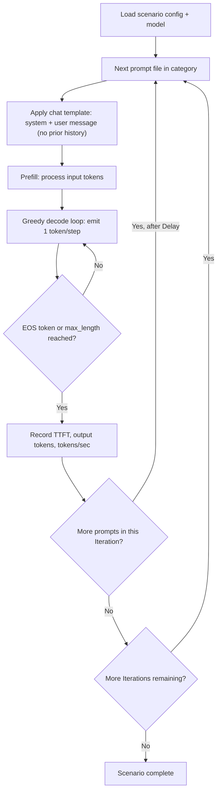
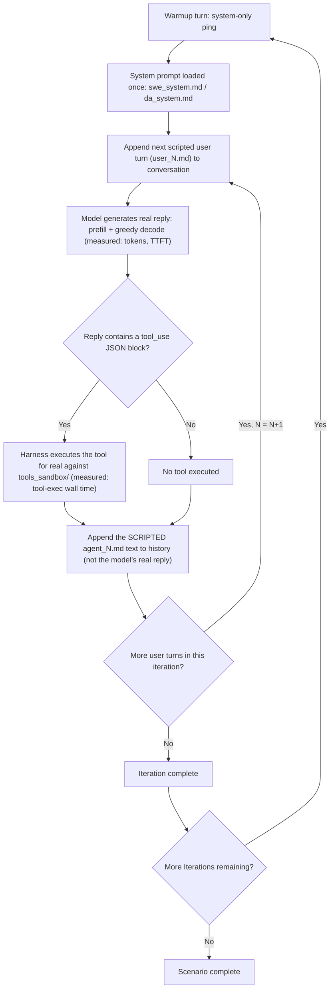
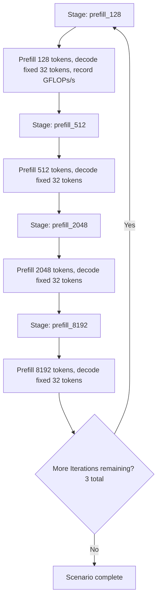
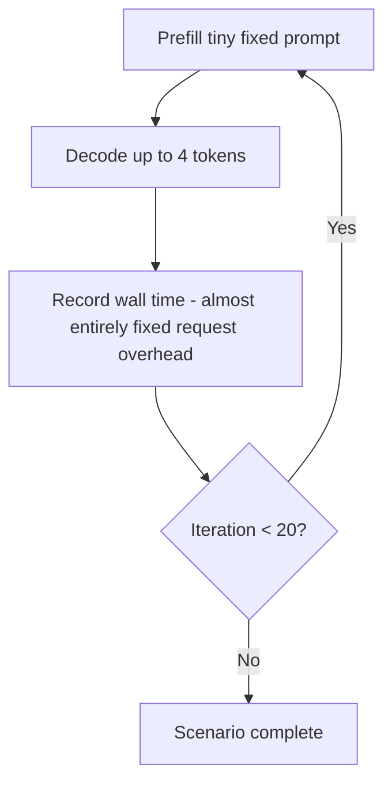
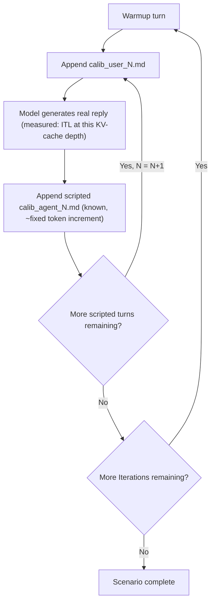
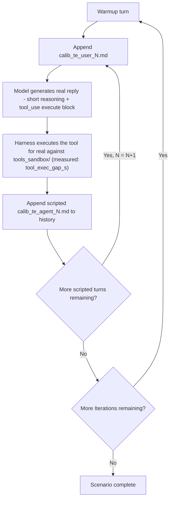

# Benchmark Descriptions

This repo runs MLPerf Client (`mlperf-windows.exe`) scenarios, wrapped with KPI-hub telemetry via
[tools/run_kpi_workflow.py](../tools/run_kpi_workflow.py). The fixed, numbered **presets** (1-8)
defined in [tools/run_kpi_preset.py](../tools/run_kpi_preset.py) and documented in
[docs/run_benchmark_prompt.md](run_benchmark_prompt.md) are the primary, production entry points.
All 8 presets use the same model (Llama 3.1 8B Instruct, `NativeOpenVINO`) and only vary by prompt
scope and target device (NPU vs iGPU). Beyond these, the repo also ships config/prompt sets for
other models and for roofline-calibration micro-benchmarks that are not part of the numbered preset
list (see [Other benchmarks not included in the presets](#other-benchmarks-not-included-in-the-presets)).

## Presets (tools/run_kpi_preset.py)

| Preset | Name | Model | Device | Scenario / prompt categories run | Description |
|---|---|---|---|---|---|
| 1 | `preset1_full_npu` | Llama 3.1 8B Instruct | NPU | Base prompt set: `content_generation`, `creative_writing`, `structured_text`, `code_analysis`, `intermediate4k` (10 prompts, 3 iterations + warmup) | Full breadth, single-turn (non-agentic) text-generation benchmark covering mixed task types (summarization/content-gen, creative writing, structured data transforms, short code analysis, ~4k-token mid-length context) using the vendor-default config bundled with the mlperf 2.0 install. |
| 2 | `preset2_full_gpu` | Llama 3.1 8B Instruct | iGPU | Same base prompt set as Preset 1 | Identical scenario to Preset 1, run on the integrated GPU (`NativeOpenVINO`/GPU) instead of the NPU, for device-to-device comparison. |
| 3 | `preset3_swe_npu` | Llama 3.1 8B Instruct | NPU | `code_analysis` only: `command_parser_cpp_2k`, `performance_counter_group_cpp_2k` (1 iteration + warmup) | Quick, single-shot (non-agentic) stand-in for code-analysis-heavy workloads — a cheaper subset of Preset 1's prompt mix, useful for fast iteration. |
| 4 | `preset4_swe_gpu` | Llama 3.1 8B Instruct | iGPU | Same 2 code-analysis prompts as Preset 3 | Identical scenario to Preset 3, run on the iGPU. |
| 5 | `preset5_sweagent_npu` | Llama 3.1 8B Instruct | NPU | Real **SWE Agent** agentic scenario (`swe-agent-prompts.json`, `IsAgentic: true`), base prompt set, 3 iterations | Multi-turn agentic coding-assistant conversation (`swe_warmup` → `swe_system`/`swe_user_0` → `swe_agent_0` → ...) where the model actually invokes the CLI's `execute` tool against a bundled `tools_sandbox.zip`. Represents an agentic software-engineering workflow end to end (reasoning + real tool calls), not just raw text generation. |
| 6 | `preset6_sweagent_gpu` | Llama 3.1 8B Instruct | iGPU | Same SWE Agent scenario as Preset 5 | Identical scenario to Preset 5, run on the iGPU. |
| 7 | `preset7_dataagent_npu` | Llama 3.1 8B Instruct | NPU | Real **Data Analyst Agent** scenario (`da-agent-scenario.json`), same config file as Preset 5 but selected via `-q ext` (extended prompt set), 3 iterations | Multi-turn agentic data-analysis conversation (`da_warmup` → `da_system`/`da_user_0` → `da_agent_0` → ... → `da_user_3`/`da_agent_3`) using the same tool-execution sandbox as the SWE Agent scenario, but a data-analyst persona/task set instead of a software-engineer one. |
| 8 | `preset8_dataagent_gpu` | Llama 3.1 8B Instruct | iGPU | Same Data Agent scenario as Preset 7 | Identical scenario to Preset 7, run on the iGPU. |

All 8 presets produce the same KPI artifacts per run: `workflow_kpi.json` (per-prompt tokens/sec,
TTFT, Gantt timeline), `hw_samples.csv` (HW utilization/power), `dashboard.html`, and
`kpi_report.html`.

## Other benchmarks not included in the presets

### Roofline-calibration micro-benchmarks

[tools/roofline_calibration/](../tools/roofline_calibration/) defines 4 additional Llama 3.1
8B Instruct benchmarks (configs under `data/configs/kpi_presets/roofline_calibration/`, one
`_NPU`/`_GPU` variant each), run via `tools/roofline_calibration/run_calibration.py` rather than
`run_kpi_preset.py`. Each isolates exactly one scaling assumption used by
[tools/run_roofline_projection.py](../tools/run_roofline_projection.py)'s projection model, instead
of measuring a realistic, workload-mixed scenario:

| Preset key | Scenario shape | Isolates |
|---|---|---|
| `prefill_sweep` | Fixed short output (32 tokens), sweeping input context length (128/512/2048/8192 tokens), 4 stages, 3 iterations, non-agentic | Prefill/compute scaling curve (`compute_efficiency_retention`) |
| `thin_serving` | Minimal near-zero-work round trips repeated 20 times, non-agentic | Fixed per-request software/IPC overhead (`stage_overhead_s`), isolated from real compute/memory work |
| `kv_cache_growth` | Scripted agentic multi-turn conversation where each turn adds a known, roughly-equal token increment to history, `IsAgentic: true` | Memory/ITL scaling with KV-cache depth (`memory_efficiency_retention`) |
| `tool_exec_only` | Agentic scenario prompting the model to invoke `tools_sandbox/` scripts with minimal reasoning text, `IsAgentic: true`, `ToolsExecution: true` | CPU-bound tool-execution overhead vs. Amdahl's law parallel fraction (`cpu_efficiency_retention` / `tool_parallel_fraction`) |

These correspond to the `kv_cache_growth_*`, `prefill_sweep_*`, `thin_serving_*`, and
`tool_exec_only_*` directories already present under [kpi_runs/](../kpi_runs/).

### Other models (not wired into any preset or calibration script)

The repo bundles config files and prompt sets for 3 additional text models and 1 image-generation
model (per `docs/EULA/MLPerf Client v2.0 license.txt`'s license mapping table), none of which are
referenced by `run_kpi_preset.py` or `tools/roofline_calibration`. They can only be run manually by
pointing `mlperf-windows.exe` (or `run_kpi_workflow.py --config ...`) directly at their config files:

| Model | Config location | Prompt categories available | Notes |
|---|---|---|---|
| Qwen 3 8B | `data/configs/vendors_default/llm/extended/qwen3/`, `data/configs/vendors_default/agentic/extended/qwen3/` | `content_generation`, `creative_writing`, `structured_text`, `code_analysis`, `intermediate4k`, `substantial8k`, `swe_agent`, `data_agent` (`data/prompts/qwen_3_8b/`) | Same prompt-category shape as Llama 3.1 8B Instruct (base text-generation + agentic SWE/Data Agent); supports AMD OrtGenAI-RyzenAI/WindowsML, Intel OpenVINO/WindowsML, macOS llama.cpp/MLX, NVIDIA llama.cpp EPs. |
| Phi 4 Mini Instruct | `data/configs/vendors_default/llm/phi4mini/` | `content_generation`, `creative_writing`, `structured_text`, `code_analysis`, `intermediate4k`, `substantial8k` (`data/prompts/phi_4_mini_instruct/`) | Non-agentic text-generation prompt set only (no `swe_agent`/`data_agent`); AMD RyzenAI EPs. |
| Phi 4 Reasoning 14B | `data/configs/vendors_default/llm/extended/phi4reason/` | `content_generation`, `creative_writing`, `structured_text`, `code_analysis`, `intermediate4k`, `substantial8k`, `swe_agent`, `data_agent` (`data/prompts/phi_4_reasoning_14b/`) | Larger reasoning-oriented model; same prompt-category shape as Llama 3.1 8B/Qwen 3 8B. |
| FLUX.2 [klein] 4B | `data/configs/vendors_default/image-gen/experimental/flux2klein/` | `data/prompts/flux_2_klein_4b/flux_2_klein_prompts.json` | Image-generation (text-to-image) model, not an LLM text-generation scenario — exercised via the `Diffusers`/RyzenAI IHV path (`src/CIL/IHV/Diffusers/`), marked `experimental` in its config path. |

## Prompt categories: behavior flow

Every prompt-category JSON (`data/prompts/<model>/<category>/*.json`) defines its own
`model_config.search` (greedy decoding, `max_length`) and either inline `system`/`user` text or
(for `prompt_files: true` scenarios) references to Markdown files holding each conversation turn.
Despite differing task content, each category falls into one of three execution shapes below.

### Single-turn categories (content_generation, creative_writing, structured_text, code_analysis, intermediate4k, substantial8k)

Each prompt in these categories is an independent system+user pair with no conversation history —
the model prefills the prompt once, greedily decodes until `max_length` or EOS, and moves on. They
differ only in task content and size, not in execution shape:

| Category | Task content | Context length | Max output |
|---|---|---|---|
| `content_generation` | Reasoning/QA-style prompts (e.g. entailment judgments) | 4096 | 256 |
| `creative_writing` | Open-ended narrative/creative prompts | 4096 | 256 |
| `structured_text` | Data-format transforms (e.g. CSV → JSON) | 4096 | 256 |
| `code_analysis` | Explain/interpret a ~2K-token C++ source snippet | 5120 | 128 |
| `intermediate4k` | Long-document summarization (~4K-token source) | 4096 | 128 |
| `substantial8k` | Longer-document summarization (~8K-token source) | larger (8K-class) | 128 |

### Agentic categories (swe_agent, data_agent)

Both are fixed, pre-scripted multi-turn conversations (`"IsAgentic": true`, `prompt_files: true`).
Per [docs/AGENTIC_WORKFLOW_CHARACTERIZATION.md](AGENTIC_WORKFLOW_CHARACTERIZATION.md), the turn
sequence is fixed regardless of what the model outputs: only the `system`/`user` turns trigger a
real, measured inference call (prefill+decode, TTFT, tool-call parsing); the interleaved `agent`
turns are canned Markdown files spliced into the conversation history as-is (not generated),
keeping each turn's input context length deterministic and reproducible across hardware/backends.
If the model's real reply for a turn contains an Anthropic-style `tool_use` JSON block, the harness
executes that tool for real against the bundled `tools_sandbox/` before the next turn.

- `swe_agent`: 1 warmup + 3 real turns (`swe_user_0/1/2.md`) per iteration, 3 iterations (12 stages
  total). Tools: `read_file`, `write_file`, `apply_patch`, `execute_command`.
- `data_agent`: 1 warmup + 4 real turns (`da_user_0..3.md`) per iteration, 3 iterations (15 stages
  total). Tools: `read_file`, `write_file`, `execute`.

### Roofline-calibration categories (prefill_sweep, thin_serving, kv_cache_growth, tool_exec_only)

Synthetic micro-benchmarks (see [tools/roofline_calibration/presets.py](../tools/roofline_calibration/presets.py))
built to isolate one scaling variable at a time instead of a realistic, workload-mixed scenario.

**`prefill_sweep`** — 4 independent, single-turn stages, each a synthetic filler prompt padded to a
fixed input length (128 / 512 / 2048 / 8192 tokens) with a fixed short output cap (32 tokens), 3
iterations. Isolates how prefill time scales with input length alone (decode cost held constant).

**`thin_serving`** — a single trivial system+user pair ("Reply with exactly one word."/"Say OK."),
`max_length: 4`, repeated via `Iterations: 20` instead of varying content. Isolates the fixed
per-request software/IPC overhead, since real compute/memory work is near-zero by design.

**`kv_cache_growth`** — same scripted-turn shape as `swe_agent`/`data_agent` (`IsAgentic: true`,
`calib_warmup.md` → `calib_system.md`/`calib_user_0.md` → `calib_agent_0.md` → ...), but with
synthetic turns engineered so each scripted `agent` turn adds a known, roughly-equal token
increment to history. Isolates how ITL changes as KV-cache depth grows in controlled steps.

**`tool_exec_only`** — same scripted-turn shape, `IsAgentic: true` + `ToolsExecution: true`,
prompting the model to emit a tool_use `"execute"` block with minimal surrounding reasoning text.
Isolates the CPU-bound tool-execution gap (`tool_exec_gap_s`) from real LLM decode time.

