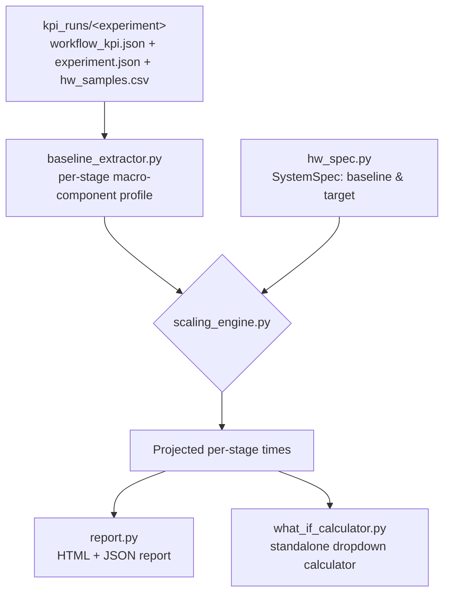

# Roofline Hardware Projection Methodology

Canonical reference for `tools/roofline_projection/` (+ CLI `tools/run_roofline_projection.py`):
a bottom-up, macro-component pipeline that projects a **measured** `kpi_runs/<experiment>` run
(this machine) onto a **hypothetical target system** with more CPU cores, iGPU XeCores, NPU MACs,
and/or memory bandwidth — answering "if we ran this same agentic workload on a heavier-duty
machine, how much would wall time / tokens-per-second / tokens-per-Joule improve, and *why*?"

This builds directly on the roofline analysis already in `tools/KPI-hub/generate_kpi_report.py`
(see [AGENTIC_WORKFLOW_CHARACTERIZATION.md §9-11](AGENTIC_WORKFLOW_CHARACTERIZATION.md)) which
plots *this machine's own* measured (arithmetic intensity, achieved GFLOPs/s) points against
*this machine's own* roofs. That answers "how efficiently does this run use *this* hardware?".
This tool answers a different question: "how would the *same measured behavior* change on
*different* hardware?" — it is a projection/what-if tool, not a new measurement.

## 1. Why bottom-up macro components, not a single wall-time multiplier

A single "the CPU is N% faster so wall time is 1/N" multiplier is wrong for an agentic LLM
workflow because different parts of the wall-clock timeline are bound by *different* resources:

| Macro component | Bound by | Scales with |
|---|---|---|
| **Prefill** (prompt/context processing) | Compute (large batched GEMMs) | Accelerator compute capability (NPU MACs × freq, or iGPU XeCores × freq) |
| **Decode** (autoregressive token generation, batch=1) | Memory bandwidth (re-reads full model weight per token) | Memory channels × width × transfer rate |
| **Tool execution** (git apply, pytest, file IO, ...) | CPU (mostly single/few-threaded processes) | CPU cores × frequency, via Amdahl's law (not everything parallelizes) |
| **Stage/harness overhead** (logging, IPC, bookkeeping) | Fixed cost of the software stack | Nothing — assumed constant |

Scaling the whole wall time by one factor would over- or under-credit whichever component
happens to dominate a given stage. The bottom-up approach decomposes each stage into these four
buckets, projects **each bucket independently** by the resource ratio that actually governs it,
then **sums back up** — giving a physically-grounded total, not a guess.



## 2. Step 1 — Baseline extraction (`baseline_extractor.py`)

For every non-orchestrator stage in `workflow_kpi.json`, already-measured fields are turned into
four time buckets (no new measurement, pure arithmetic on existing fields):

```
prefill_s          = prefill_ms_est / 1000                         # already derived: ttft_ms - avg_itl_ms
decode_s           = avg_itl_ms / 1000 * output_tokens              # per-token decode latency × tokens generated
                     # (if prefill_s + decode_s > wall_time_s due to measurement noise, both are
                     # rescaled proportionally so the invariant below holds exactly, not just usually)
stage_overhead_s   = max(wall_time_s - prefill_s - decode_s, 0)     # residual bookkeeping inside the stage
tool_exec_gap_s    = max(next_stage.start_epoch - this_stage.end_epoch, 0)   # harness runs a tool here (NPU/iGPU idle)
                     # for the LAST stage, "next_stage.start_epoch" is workflow timeline.end_epoch,
                     # not 0 - a final verification/tool call after the last LLM turn is still
                     # CPU-bound tool-exec time, not workflow-level fixed overhead (see below)
```

By construction: `sum(all four buckets across all stages) + fixed_overhead_s == workflow_wall_time_s`,
where `fixed_overhead_s` is whatever's left over — with the last-stage fix above, this is now (for
all 4 validated runs) essentially just the gap BEFORE the first stage starts (process startup,
model load), not a mix of that plus an unaccounted-for tail after the last stage.

> **2026-09-24 fix**: an earlier version always set `tool_exec_gap_s = 0` for a run's last stage
> (it only looked at the *next* stage's start, and there is none), so any real tool-call time after
> the final LLM turn silently fell into `fixed_overhead_s`, which never scales with target hardware
> — understating projected speedup for workloads whose last action is a heavy CPU-bound tool call.
> Fixed by using the workflow's own `timeline.end_epoch` as the "next start" for the last stage.

If `hw_samples.csv` is present, RAPL power (`rapl_cpu_w`/`rapl_igpu_w`/`rapl_npu_w`/`rapl_soc_w`)
is averaged over each stage's **whole bucket window** (`start_iso` through the *next* stage's
`start_iso`, or `workflow_end_iso` for the last stage — i.e. prefill+decode+overhead+tool_exec_gap,
not just the stage's own active `start_iso`→`end_iso`) for optional energy/Tokens-per-Joule
projection (best-effort — silently omitted if pandas isn't installed or the columns are
absent/zero, never a hard requirement for the wall-time projection). The window is deliberately
widened past `end_iso` because the averaged watts get multiplied by that same whole-bucket
duration downstream (`scaling_engine.py`'s `energy_j` calc) — averaging only over the active
sub-window and then applying it across the full bucket would misattribute the (typically higher)
active-generation power to the (typically lower, accelerator-idle) tool-exec-gap time too,
overstating energy for any stage with a real gap. **The lookup window uses `start_iso`/`end_iso` (naive
local-time strings), NOT `start_epoch`/`end_epoch`** — this matters and is not an arbitrary choice:
`hw_samples.csv`'s `timestamp` column is naive local time written by the sampler subprocess, while
`start_epoch`/`end_epoch` are true UTC Unix epoch from `time.time()` in the orchestrator process.
Converting the CSV's naive-local strings to Unix epoch (e.g. via pandas `datetime64->int64`)
silently produces a wrong, timezone-offset-shifted value with **no error** — every stage window
then matches zero rows, and Tokens/Joule always comes back `None` with no indication why. This
exact bug was hit and fixed during development (see `tools/roofline_projection/baseline_extractor.py`
`_load_power_lookup`'s docstring) by switching to the same naive-datetime-comparison approach
already proven correct in `tools/KPI-hub/plot_utilization_interactive.py::load_phases()`.

TTFT and per-token decode latency (ITL) are also captured per stage for direct reporting
(`ttft_ms = ttft_s*1000` straight from the log when present, else `prefill_s*1000 + itl_ms` as a
fallback; `itl_ms = avg_itl_ms` straight from the log) — these mirror the same definitions
established in `docs/AGENTIC_WORKFLOW_CHARACTERIZATION.md` §8.

## 3. Step 2 — Hardware spec + capability ratios (`hw_spec.py`)

A `SystemSpec` is the exact set of knobs the what-if dropdown UI exposes:

```
cpu_cores, cpu_freq_ghz
igpu_xecores, igpu_freq_ghz
npu_macs, npu_freq_ghz
mem_channels, mem_width_bits, mem_freq_mts
```

Derived "relative capability" numbers (linear in count × frequency — **not** claimed to be
physical FLOPs/s, since no verified vendor FLOPs-per-MAC / FLOPs-per-XeCore constant exists for
this exact silicon+workload combination, see `docs/KPI_HUB_INTEGRATION_NOTES.md`):

```
cpu_capability   = cpu_cores × cpu_freq_ghz
igpu_capability  = igpu_xecores × igpu_freq_ghz
npu_capability   = npu_macs × npu_freq_ghz
mem_bw_peak_gbs  = mem_channels × (mem_width_bits / 8) × mem_freq_mts / 1000
```

Because every projection downstream only ever uses **ratios** between a baseline and a target
`SystemSpec` (never an absolute value), the fact that these are relative units rather than
verified physical peaks doesn't matter — the ratio is dimensionally consistent and self-cancels
any unknown proportionality constant. This is the same self-referential-calibration principle
already used by the empirical-compute-peak fix in `generate_kpi_report.py`'s roofline chart.

**Important**: `cpu_cores`/`igpu_xecores`/`npu_macs` counts are **not auto-detectable** from this
benchmark's tooling (only `cpu_cores`, and `mem_channels`/`mem_width_bits`/`mem_freq_mts` via
`Get-CimInstance Win32_PhysicalMemory`, are). You must supply your baseline machine's real iGPU
XeCore / NPU MAC counts from its datasheet — see
`data/configs/roofline_targets/current_baseline_TEMPLATE.json`.

## 4. Step 3 — Scaling engine (`scaling_engine.py`)

Per stage, per macro component:

```
raw_speedup(target, baseline)              = target / baseline                          (guarded against /0)

effective_speedup(raw, retention)          = 1 + (raw - 1) × retention
    # retention ∈ [0,1]: 1.0 = ideal ("iso-efficiency") scaling - the resource ratio is fully
    # realized. Lower values model real-world losses at scale (NUMA, contention, driver
    # overhead) that keep bigger systems from scaling perfectly linearly. Default: 0.85.

amdahl_speedup(cores_ratio, freq_ratio, p) = freq_ratio / ((1 - p) + p / cores_ratio)
    # Amdahl's law for CPU-bound tool execution. p = assumed parallel fraction of that time
    # (default 0.5 - process spawn/disk IO/etc. don't scale with core count, only some work does).
    # freq_ratio multiplies the WHOLE expression, not just the parallel term: a faster clock
    # speeds up every instruction regardless of how many cores it runs on, so the serial fraction
    # benefits from freq_ratio exactly as much as the parallel fraction does - only extra CORES are
    # gated by p. (A fixed 2026-09-24 bug: an earlier version divided only the parallel term by
    # freq_ratio, which implied a 100%-serial component, p=0, gets ZERO benefit from a faster clock
    # - clearly wrong, since serial code still runs faster on a faster core. Corrected here.)
```

Applied per stage:

```
compute_eff  = effective_speedup( raw_speedup(target.compute_capability(device_type),
                                               baseline.compute_capability(device_type)), retention )
prefill_target = prefill_s / compute_eff

mem_eff      = effective_speedup( raw_speedup(target.mem_bw_peak_gbs, baseline.mem_bw_peak_gbs), retention )
decode_target = decode_s / mem_eff

cpu_eff      = effective_speedup( amdahl_speedup(cores_ratio, freq_ratio, p), retention )
tool_target  = tool_exec_gap_s / cpu_eff

overhead_target = stage_overhead_s          # unchanged - not resource-bound

projected_stage_wall = prefill_target + decode_target + tool_target + overhead_target

# TTFT/ITL (ms): ITL scales with the same per-token memory speedup that drives decode_target,
# since decode_target IS itl_ms/1000*output_tokens / mem_eff.
itl_target_ms    = itl_ms / mem_eff
ttft_target_ms   = prefill_target * 1000 + itl_target_ms
```

Rolled up:

```
Total baseline wall  = Σ(stage buckets) + fixed_overhead_s      == workflow_wall_time_s (sanity check)
Total projected wall = Σ(projected stage buckets) + fixed_overhead_s   (fixed_overhead_s unchanged)

Speedup             = Total baseline wall / Total projected wall
Wall time reduction = (Total baseline wall - Total projected wall) / Total baseline wall × 100%
Tokens/s            = total_output_tokens / Total wall (baseline and projected)
Avg TTFT / Avg ITL  = output-token-weighted mean(ttft_ms) / mean(itl_ms) across every stage that
                      actually decoded output (weighted so a 1000-token turn counts more than a
                      44-token warmup call - a plain per-stage average would misrepresent what a
                      user actually experienced across the session)
```

`device_type` (NPU / GPU-iGPU / CPU) is read straight from `experiment.json` and determines which
accelerator capability (`npu_capability`, `igpu_capability`, or `cpu_capability`) governs that run's
prefill scaling — matching which device actually ran the workload. An unrecognized `device_type`
raises rather than silently defaulting (an earlier version defaulted anything that wasn't `"NPU"`
to `igpu_capability`, which would have silently mis-scaled prefill for a hypothetical CPU-only run).

### Power / energy (Tokens/Joule)

Only computed if at least one stage has measured RAPL power (`hw_samples.csv`'s
`rapl_cpu_w`/`rapl_igpu_w`/`rapl_npu_w`/`rapl_soc_w`, averaged per stage - see §2):

```
ratio(domain) = target.<domain>_capability / baseline.<domain>_capability     # cpu/igpu/npu
ratio("soc")  = 1.0   # uncore/SoC rail assumed roughly fixed regardless of core/EU/MAC count

projected_power_w[domain] = baseline_power_w[domain] × ratio(domain) ^ power_scaling_exponent
    # power_scaling_exponent: 1.0 = linear (dynamic power ∝ resource count × freq, the common
    # simplifying assumption at iso process-node). Default 1.0.

Total baseline energy_j  = Σ(stage)  Σ(domain, baseline_power_w[domain])  × stage.baseline_wall_s
Total projected energy_j = Σ(stage)  Σ(domain, projected_power_w[domain]) × stage.projected_wall_s

Tokens/Joule = total_output_tokens / Total energy_j   (baseline and projected)
```

## 5. Step 4 — Outputs (`report.py`, `what_if_calculator.py`)

- **`roofline_projection_report.html` / `.json`** (`tools/run_roofline_projection.py`): a static
  report for one specific baseline-spec/target-spec/assumptions combination — summary cards,
  spec-comparison table, a stacked-bar chart (baseline vs. projected macro components per stage),
  and a per-stage speedup table. Visual style matches `tools/KPI-hub/generate_kpi_report.py`.
- **`what_if_calculator.html`** (`--what-if` flag): a **standalone, offline** HTML file with the
  baseline profile embedded as JSON and the exact same scaling math re-implemented in vanilla JS
  (`_JS_ENGINE` in `what_if_calculator.py` — kept in sync with `hw_spec.py`/`scaling_engine.py` by
  convention, no shared code since this must run with no server/build step). Dropdowns for CPU
  cores/frequency, iGPU XeCores/frequency, NPU MACs/frequency, and memory channels/width/transfer
  rate, plus sliders for efficiency retention / tool-exec parallel fraction / power scaling
  exponent, recompute the projected wall time, speedup, tokens/s, avg TTFT/ITL, and Tokens/Joule
  (when RAPL power data exists) live on every change; a "quick preset" dropdown loads any
  `SystemSpec` JSON from `data/configs/roofline_targets/`. A "Generate a Persisted Report" section
  lets you take the current selection back to the CLI (copy a ready-to-run command, or download a
  `--target-spec`-compatible JSON) since this page has no filesystem/server access to write a
  report itself.

  **Only one accelerator group is ever "hot" per run.** `computeCapability()` picks either
  `npuCapability` or `igpuCapability` based on the baseline run's own `device_type` (NPU vs
  GPU/iGPU) — never both. The calculator reflects this directly: whichever accelerator group
  doesn't match the loaded run's `device_type` is visually greyed out and its dropdowns disabled
  (labeled "not used - this run used NPU/GPU"), so it's never ambiguous which knobs actually move
  the numbers. This also means the tool is symmetric — running it against an NPU-baseline run
  (e.g. `preset5_roofline_*`) makes the NPU MACs/frequency dropdowns live and iGPU inert; running
  it against an iGPU-baseline run (e.g. `preset6_roofline_*`) flips that, making iGPU XeCores/
  frequency live and NPU inert. There is intentionally no cross-accelerator projection (e.g.
  projecting an NPU-measured run onto an iGPU-capability target) — MAC-count×frequency and
  XeCore-count×frequency are not calibrated to the same physical FLOPs-per-unit constant (see
  §8.2 below), so mixing them across accelerator types would produce numbers with no defensible
  basis. To get a real iGPU projection, generate the calculator from an actual iGPU baseline run.

## 6. Usage

```powershell
# One-shot report against an illustrative target preset (fills in a generic placeholder baseline)
.venv\Scripts\python.exe tools\run_roofline_projection.py `
    --run kpi_runs\preset5_roofline_20260923_140129 `
    --target-spec data\configs\roofline_targets\example_heavy_duty_workstation.json --what-if

# Recommended: fill in your real baseline spec once (data/configs/roofline_targets/current_baseline_TEMPLATE.json),
# then reuse it for every projection
.venv\Scripts\python.exe tools\run_roofline_projection.py `
    --run kpi_runs\preset5_roofline_20260923_140129 `
    --baseline-spec data\configs\roofline_targets\current_baseline_TEMPLATE.json `
    --target-spec data\configs\roofline_targets\example_heavy_duty_workstation.json `
    --efficiency-retention 0.8 --tool-parallel-fraction 0.4 --what-if
```

Output defaults to `<run>/roofline_projection/` (report + `what_if_calculator.html` if `--what-if`
was passed). Individual target-spec fields can also be overridden directly on the CLI, e.g.
`--cpu-cores 24 --mem-freq-mts 9600`, without needing a JSON file.

## 7. Worked example (validated 2026-09-24)

Projecting `kpi_runs/preset5_roofline_20260923_140129/` (NPU, Llama-3.1-8B-Instruct, 12 real
inference stages across 3 SWE-Agent iterations) from the built-in default baseline spec (8 cores
@ 4 GHz / 96 XeCores @ 2 GHz / 2048 NPU MACs @ 1.4 GHz / 8ch×16-bit×8533 MT/s = 136.5 GB/s) onto
`example_heavy_duty_workstation.json` (32 cores @ 5 GHz / 384 XeCores @ 2.4 GHz / 8192 NPU MACs @
1.6 GHz / 8ch×64-bit×8800 MT/s = 563.2 GB/s — a ~4x jump in every resource) at default assumptions
(efficiency retention 0.85, tool-exec parallel fraction 0.5):

| | Baseline | Projected |
|---|---|---|
| Wall time | 492.5s | 168.0s |
| Speedup | — | **2.93x** |
| Wall time reduction | — | **65.9%** |
| Tokens/s | 11.2 | 32.7 |
| Tokens/Joule | 0.35 | 0.48 |

Per-resource effective speedups actually applied: compute (NPU) 4.04x, memory 3.66x, CPU/tool-exec
(Amdahl, p=0.5) **1.85x** — note none of these equal the raw 4x/4.13x/4x hardware ratios, because the
0.85 efficiency-retention damping and (for CPU) Amdahl's law both intentionally pull the realized
speedup below the ideal. Reproducible via both the CLI (`tools/run_roofline_projection.py`) and
the generated `what_if_calculator.html` (verified to produce identical numbers).

> **2026-09-24 correction**: this table now reflects a fixed `amdahl_speedup` (see §4 equation box)
> — an earlier version divided only the parallel term by `freq_ratio`, giving a 100%-serial tool-exec
> fraction zero benefit from clock-frequency increases. The fix raises the realized CPU/tool-exec
> speedup (1.57x → 1.85x here), which is why wall-time speedup/reduction/Tokens-per-s are all
> slightly higher than an earlier version of this doc reported. The `Avg TTFT`/`Avg ITL` rows were
> also dropped from this static table because their definition changed to an output-token-weighted
> mean (see §4) — use the CLI or the what-if calculator for current per-run TTFT/ITL numbers.

The same projection against the **iGPU** baseline (`kpi_runs/preset6_roofline_20260923_141035/`,
`device_type=GPU`, 689.8s baseline) onto the same target spec:

| | Baseline | Projected |
|---|---|---|
| Wall time | 689.8s | 212.6s |
| Speedup | — | **3.25x** |
| Wall time reduction | — | **69.2%** |
| Tokens/s | 13.3 | 43.1 |
| Tokens/Joule | 0.25 | 0.33 |

Here `compute_capability()` resolves to `igpu_capability` instead (this run's `device_type` is
`GPU`, not `NPU`) — verified in the what-if calculator: the NPU MACs/frequency dropdowns render
greyed out/disabled ("not used - this run used GPU") while iGPU XeCores/frequency are the live
ones.

Also validated (no code changes needed) against the Data Agent scenario, both device types:
`kpi_runs/preset7_dataagent_npu_20260923_220921/` (788.7s → 343.2s, 2.30x, 56.5% reduction,
Tokens/J 0.35→0.40) and `kpi_runs/preset8_dataagent_gpu_20260923_225621/` (910.2s → 288.6s, 3.15x,
68.3% reduction, Tokens/J 0.40→0.50) — confirming the pipeline generalizes across both agent
scenarios (SWE Agent / Data Agent) and both accelerator types without any scenario-specific code.

> **2026-09-24 correction**: Tokens/Joule numbers above also reflect the power-lookup-window
> widening fix (see §2) — an earlier version averaged RAPL power only over each stage's own
> active window then applied it across that stage's whole bucket (including its tool-exec gap),
> which overstated energy whenever the accelerator's gap-time power was lower than its
> active-generation power (confirmed on preset8: e.g. one stage measured 10.48W active vs 0.00W
> during its own trailing gap). Wall-time/speedup numbers are unaffected by this fix.

## 8. Known limitations / assumptions (be explicit about these when presenting results)

1. **Iso-efficiency projection, not a cycle-accurate simulator.** Compute and memory scaling
   assume the *utilization %* achieved on the baseline machine is achievable on the target machine
   too (subject to the efficiency-retention knob) — real silicon can behave non-linearly (cache
   effects, NUMA topology changes, driver/firmware differences) in ways this model cannot capture.
2. **iGPU/NPU peak-capability ratios use count × frequency as a linear proxy**, not a verified
   FLOPs-per-MAC/FLOPs-per-XeCore constant (none exists for this exact silicon+workload — see
   `docs/KPI_HUB_INTEGRATION_NOTES.md`). This is fine for *ratios* between two specs using the
   same proxy, but the absolute "capability" numbers are not physical FLOPs/s.
3. **Fixed overhead and stage overhead are assumed constant** regardless of target hardware. In
   reality faster storage/single-thread performance could shrink model-load time somewhat — this
   model treats that as a conservative (i.e. the real system would do at least this well) simplification.
4. **Tool execution's Amdahl parallel fraction (default 0.5) is a modeling assumption**, not
   measured per-tool — `git apply`/`pytest`/file IO have different real parallelizability. Treat
   the CPU-scaling column as directional, and adjust `--tool-parallel-fraction` if you have better
   data for your actual tool mix.
5. **Power/energy projection (Tokens/Joule) requires RAPL power columns actually populated in
   `hw_samples.csv`** for the relevant domain (cpu/igpu/npu/soc) — silently omitted (shown as
   `N/A`) if `hw_samples.csv` is missing, pandas isn't installed, or every column reads zero for
   that run. Assumes power scales with the same capability ratio as compute (dynamic power ∝
   resource count × frequency, `power_scaling_exponent` default 1.0/linear) while the "soc"/uncore
   rail is assumed roughly fixed regardless of core/EU/MAC count. Verified working (non-null,
   physically plausible values) on all 4 validated runs once the lookup used naive `start_iso`/
   `end_iso` matching instead of an epoch/timezone-mismatched conversion (see §2) — if you see
   `N/A` on a run with `--power` known to have been enabled during collection, suspect this same
   class of alignment bug before assuming the hardware simply didn't report power for that domain.
   **Fixed 2026-09-24**: the averaging window itself was also widened to span each stage's whole
   bucket (through its tool-exec gap), not just its own active `start_iso`→`end_iso` — see §2.
6. ~~The trailing gap after a run's LAST stage falls into `fixed_overhead_s` (unscaled), not
   `tool_exec_gap_s` (Amdahl-scaled).~~ **Fixed 2026-09-24**: the last stage's `tool_exec_gap_s` is
   now computed against the workflow's `timeline.end_epoch`, not hardcoded to `0` — any real
   tool-call/verification time after the final LLM turn is now Amdahl-scaled like every other
   inter-stage gap, and `fixed_overhead_s` now represents only the gap *before* the first stage
   (process startup/model load). See `baseline_extractor.py::extract_baseline`.
7. ~~`compute_capability()` only distinguishes `NPU` from everything else.~~ **Fixed 2026-09-24**:
   `compute_capability()` now explicitly handles `NPU` / `GPU`&`IGPU` / `CPU` and raises a clear
   error on anything else, instead of silently routing an unrecognized `device_type` (e.g. a
   hypothetical `CPU` baseline) to `igpu_capability`. See `hw_spec.py::SystemSpec.compute_capability`.
8. **`efficiency_retention` and Amdahl's law compound multiplicatively for tool-exec.** The
   CPU/tool-exec speedup is Amdahl-damped *and then* further discounted by `efficiency_retention` —
   two independent "be conservative" knobs stack, so tool-exec ends up more heavily discounted than
   compute/memory for the same `efficiency_retention` value. This is intentional (tool-exec
   involves OS scheduling/process-spawn overhead that compute/memory scaling doesn't), but keep it
   in mind when tuning both sliders in the what-if calculator — their effects are not independent.
9. **Tokens/Joule silently treats any stage with no RAPL-power match as 0 energy for that stage**,
   not as "unknown"/excluded. `has_power` only requires *one* stage in the whole run to have
   power data to turn Tokens/Joule on at all; any other stage whose lookup window happened to miss
   every CSV row (very short stage, sampler gap, etc.) contributes `0` watts × its wall time to the
   energy total instead of being excluded, which would silently bias Tokens/Joule optimistic (too
   high) for that run. Not observed in any of the 13 runs in this repo (every stage in every run
   has non-empty `avg_power_w`), but there's no coverage check or warning if it ever happens —
   treat a Tokens/Joule number as suspect if `hw_samples.csv`'s sampling interval is coarse relative
   to a run's shortest stage.
10. ~~`stage_overhead_s = max(wall_time_s - prefill_s - decode_s, 0)` could silently break the
    "sum of buckets == wall_time_s" invariant on noisy telemetry~~ **Fixed 2026-09-24**:
    `prefill_s`/`decode_s` are now rescaled proportionally (not just clamped) whenever their sum
    would exceed `wall_time_s`, so the invariant holds exactly for every stage, not just when the
    telemetry happens to agree (verified: `invariant_diff == 0.0` on all 13 runs in this repo,
    both before and after this fix — it was never actually triggered by current data, but is now
    guaranteed rather than assumed).
11. ~~`ttft_ms` was recomputed (`prefill_s*1000 + itl_ms`) instead of reading the log's own
    `ttft_s` field~~ **Fixed 2026-09-24**: now reads `ttft_s` directly when present (falling back
    to the recomputed value only if it's absent), so this stays "no new measurement, pure
    arithmetic on existing fields" even if a future log format ever changes how `ttft_s` itself is
    derived. Numerically identical to the old behavior on all 13 runs in this repo.
