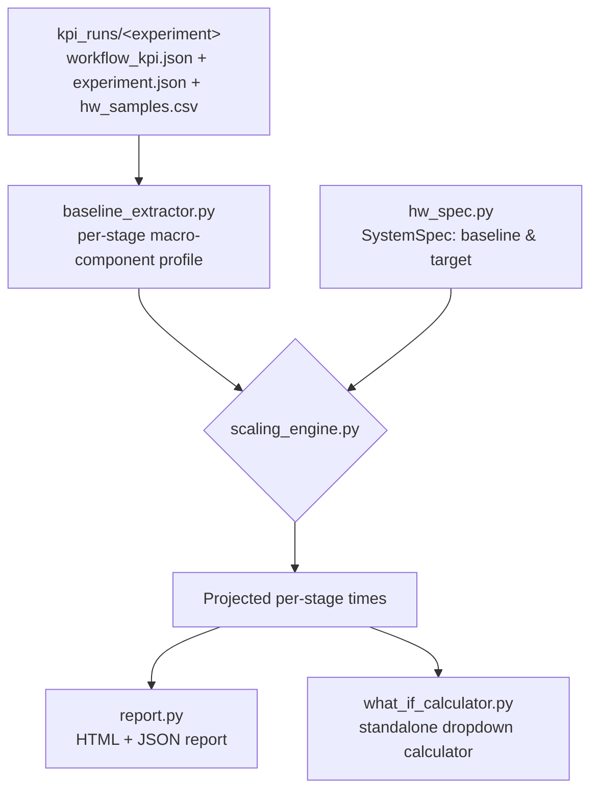

# Roofline Hardware Projection Methodology

Canonical reference for `tools/roofline_projection/` (+ CLI `tools/run_roofline_projection.py`):
a bottom-up, macro-component pipeline that projects a **measured** `kpi_runs/<experiment>` run
(this machine) onto a **hypothetical target system** with more CPU cores, iGPU XeCores, NPU MACs,
and/or memory bandwidth — answering "if we ran this same agentic workload on a heavier-duty
machine, how much would wall time / tokens-per-second / tokens-per-Joule improve, and *why*?"

This builds directly on the roofline analysis already in `tools/KPI-hub/generate_kpi_report.py`
(see [AGENTIC_WORKFLOW_CHARACTERIZATION.md §9-11](AGENTIC_WORKFLOW_CHARACTERIZATION.md)) which
plots *this machine's own* measured (arithmetic intensity, achieved GFLOPs/s) points against
*this machine's own* roofs. That answers "how efficiently does this run use *this* hardware?".
This tool answers a different question: "how would the *same measured behavior* change on
*different* hardware?" — it is a projection/what-if tool, not a new measurement.

## 1. Why bottom-up macro components, not a single wall-time multiplier

A single "the CPU is N% faster so wall time is 1/N" multiplier is wrong for an agentic LLM
workflow because different parts of the wall-clock timeline are bound by *different* resources:

| Macro component | Bound by | Scales with |
|---|---|---|
| **Prefill** (prompt/context processing) | Compute (large batched GEMMs) | Accelerator compute capability (NPU MACs × freq, or iGPU XeCores × freq) |
| **Decode** (autoregressive token generation, batch=1) | Memory bandwidth (re-reads full model weight per token) | Memory channels × width × transfer rate |
| **Tool execution** (git apply, pytest, file IO, ...) | CPU (mostly single/few-threaded processes) | CPU cores × frequency, via Amdahl's law (not everything parallelizes) |
| **Stage/harness overhead** (logging, IPC, bookkeeping) | Fixed cost of the software stack | Nothing — assumed constant |

Scaling the whole wall time by one factor would over- or under-credit whichever component
happens to dominate a given stage. The bottom-up approach decomposes each stage into these four
buckets, projects **each bucket independently** by the resource ratio that actually governs it,
then **sums back up** — giving a physically-grounded total, not a guess.



## 2. Step 1 — Baseline extraction (`baseline_extractor.py`)

For every non-orchestrator stage in `workflow_kpi.json`, already-measured fields are turned into
four time buckets (no new measurement, pure arithmetic on existing fields):

```
prefill_s          = prefill_ms_est / 1000                         # already derived: ttft_ms - avg_itl_ms
decode_s           = avg_itl_ms / 1000 * output_tokens              # per-token decode latency × tokens generated
                     # (if prefill_s + decode_s > wall_time_s due to measurement noise, both are
                     # rescaled proportionally so the invariant below holds exactly, not just usually)
stage_overhead_s   = max(wall_time_s - prefill_s - decode_s, 0)     # residual bookkeeping inside the stage
tool_exec_gap_s    = max(next_stage.start_epoch - this_stage.end_epoch, 0)   # harness runs a tool here (NPU/iGPU idle)
                     # for the LAST stage, "next_stage.start_epoch" is workflow timeline.end_epoch,
                     # not 0 - a final verification/tool call after the last LLM turn is still
                     # CPU-bound tool-exec time, not workflow-level fixed overhead (see below)
```

By construction: `sum(all four buckets across all stages) + fixed_overhead_s == workflow_wall_time_s`,
where `fixed_overhead_s` is whatever's left over — with the last-stage fix above, this is now (for
all 4 validated runs) essentially just the gap BEFORE the first stage starts (process startup,
model load), not a mix of that plus an unaccounted-for tail after the last stage.

> **2026-09-24 fix**: an earlier version always set `tool_exec_gap_s = 0` for a run's last stage
> (it only looked at the *next* stage's start, and there is none), so any real tool-call time after
> the final LLM turn silently fell into `fixed_overhead_s`, which never scales with target hardware
> — understating projected speedup for workloads whose last action is a heavy CPU-bound tool call.
> Fixed by using the workflow's own `timeline.end_epoch` as the "next start" for the last stage.

If `hw_samples.csv` is present, RAPL power (`rapl_cpu_w`/`rapl_igpu_w`/`rapl_npu_w`/`rapl_soc_w`)
is averaged over each stage's **whole bucket window** (`start_iso` through the *next* stage's
`start_iso`, or `workflow_end_iso` for the last stage — i.e. prefill+decode+overhead+tool_exec_gap,
not just the stage's own active `start_iso`→`end_iso`) for optional energy/Tokens-per-Joule
projection (best-effort — silently omitted if pandas isn't installed or the columns are
absent/zero, never a hard requirement for the wall-time projection). The window is deliberately
widened past `end_iso` because the averaged watts get multiplied by that same whole-bucket
duration downstream (`scaling_engine.py`'s `energy_j` calc) — averaging only over the active
sub-window and then applying it across the full bucket would misattribute the (typically higher)
active-generation power to the (typically lower, accelerator-idle) tool-exec-gap time too,
overstating energy for any stage with a real gap. **The lookup window uses `start_iso`/`end_iso` (naive
local-time strings), NOT `start_epoch`/`end_epoch`** — this matters and is not an arbitrary choice:
`hw_samples.csv`'s `timestamp` column is naive local time written by the sampler subprocess, while
`start_epoch`/`end_epoch` are true UTC Unix epoch from `time.time()` in the orchestrator process.
Converting the CSV's naive-local strings to Unix epoch (e.g. via pandas `datetime64->int64`)
silently produces a wrong, timezone-offset-shifted value with **no error** — every stage window
then matches zero rows, and Tokens/Joule always comes back `None` with no indication why. This
exact bug was hit and fixed during development (see `tools/roofline_projection/baseline_extractor.py`
`_load_power_lookup`'s docstring) by switching to the same naive-datetime-comparison approach
already proven correct in `tools/KPI-hub/plot_utilization_interactive.py::load_phases()`.

TTFT and per-token decode latency (ITL) are also captured per stage for direct reporting
(`ttft_ms = ttft_s*1000` straight from the log when present, else `prefill_s*1000 + itl_ms` as a
fallback; `itl_ms = avg_itl_ms` straight from the log) — these mirror the same definitions
established in `docs/AGENTIC_WORKFLOW_CHARACTERIZATION.md` §8.

## 3. Step 2 — Hardware spec + capability ratios (`hw_spec.py`)

A `SystemSpec` is the exact set of knobs the what-if dropdown UI exposes:

```
cpu_cores, cpu_freq_ghz
igpu_xecores, igpu_freq_ghz
npu_macs, npu_freq_ghz
mem_channels, mem_width_bits, mem_freq_mts
```

Derived "relative capability" numbers (linear in count × frequency — **not** claimed to be
physical FLOPs/s, since no verified vendor FLOPs-per-MAC / FLOPs-per-XeCore constant exists for
this exact silicon+workload combination, see `docs/KPI_HUB_INTEGRATION_NOTES.md`):

```
cpu_capability   = cpu_cores × cpu_freq_ghz
igpu_capability  = igpu_xecores × igpu_freq_ghz
npu_capability   = npu_macs × npu_freq_ghz
mem_bw_peak_gbs  = mem_channels × (mem_width_bits / 8) × mem_freq_mts / 1000
```

Because every projection downstream only ever uses **ratios** between a baseline and a target
`SystemSpec` (never an absolute value), the fact that these are relative units rather than
verified physical peaks doesn't matter — the ratio is dimensionally consistent and self-cancels
any unknown proportionality constant. This is the same self-referential-calibration principle
already used by the empirical-compute-peak fix in `generate_kpi_report.py`'s roofline chart.

**Important**: `cpu_cores`/`igpu_xecores`/`npu_macs` counts are **not auto-detectable** from this
benchmark's tooling (only `cpu_cores`, and `mem_channels`/`mem_width_bits`/`mem_freq_mts` via
`Get-CimInstance Win32_PhysicalMemory`, are). You must supply your baseline machine's real iGPU
XeCore / NPU MAC counts from its datasheet — see
`data/configs/roofline_targets/current_baseline_TEMPLATE.json`.

## 4. Step 3 — Scaling engine (`scaling_engine.py`)

Per stage, per macro component:

```
raw_speedup(target, baseline)              = target / baseline                          (guarded against /0)

effective_speedup(raw, retention)          = 1 + (raw - 1) × retention
    # retention ∈ [0,1]: 1.0 = ideal ("iso-efficiency") scaling - the resource ratio is fully
    # realized. Lower values model real-world losses at scale (NUMA, contention, driver
    # overhead) that keep bigger systems from scaling perfectly linearly.

amdahl_speedup(cores_ratio, freq_ratio, p) = freq_ratio / ((1 - p) + p / cores_ratio)
    # Amdahl's law for CPU-bound tool execution. p = assumed parallel fraction of that time
    # (default 0.5 - process spawn/disk IO/etc. don't scale with core count, only some work does).
    # freq_ratio multiplies the WHOLE expression, not just the parallel term: a faster clock
    # speeds up every instruction regardless of how many cores it runs on, so the serial fraction
    # benefits from freq_ratio exactly as much as the parallel fraction does - only extra CORES are
    # gated by p. (A fixed 2026-09-24 bug: an earlier version divided only the parallel term by
    # freq_ratio, which implied a 100%-serial component, p=0, gets ZERO benefit from a faster clock
    # - clearly wrong, since serial code still runs faster on a faster core. Corrected here.)
```

**2026-09-24: `efficiency_retention` is now THREE independent knobs, not one shared value** -
`compute_efficiency_retention` (prefill), `memory_efficiency_retention` (decode),
`cpu_efficiency_retention` (tool-exec, on top of Amdahl's law). See §4.1 for why: NPU-MAC,
iGPU-XeCore, and memory-bandwidth paths on a real SoC do NOT achieve the same fraction of their
own theoretical peak, so one shared "efficiency" number was hiding a real, measurable difference.
A legacy single `--efficiency-retention` / `efficiency_retention` JSON key still works and sets all
three at once (for backward compatibility) unless a per-domain value is also given.

Applied per stage:

```
compute_eff  = effective_speedup( raw_speedup(target.compute_capability(device_type),
                                               baseline.compute_capability(device_type)),
                                   compute_efficiency_retention )
prefill_target = prefill_s / compute_eff

mem_eff      = effective_speedup( raw_speedup(target.mem_bw_peak_gbs, baseline.mem_bw_peak_gbs),
                                   memory_efficiency_retention )
decode_target = decode_s / mem_eff

cpu_eff      = effective_speedup( amdahl_speedup(cores_ratio, freq_ratio, p), cpu_efficiency_retention )
tool_target  = tool_exec_gap_s / cpu_eff

overhead_target = stage_overhead_s          # unchanged - not resource-bound

projected_stage_wall = prefill_target + decode_target + tool_target + overhead_target

# TTFT/ITL (ms): ITL scales with the same per-token memory speedup that drives decode_target,
# since decode_target IS itl_ms/1000*output_tokens / mem_eff.
itl_target_ms    = itl_ms / mem_eff
ttft_target_ms   = prefill_target * 1000 + itl_target_ms
```

Rolled up:

```
Total baseline wall  = Σ(stage buckets) + fixed_overhead_s      == workflow_wall_time_s (sanity check)
Total projected wall = Σ(projected stage buckets) + fixed_overhead_s   (fixed_overhead_s unchanged)

Speedup             = Total baseline wall / Total projected wall
Wall time reduction = (Total baseline wall - Total projected wall) / Total baseline wall × 100%
Tokens/s            = total_output_tokens / Total wall (baseline and projected)
Avg TTFT / Avg ITL  = output-token-weighted mean(ttft_ms) / mean(itl_ms) across every stage that
                      actually decoded output (weighted so a 1000-token turn counts more than a
                      44-token warmup call - a plain per-stage average would misrepresent what a
                      user actually experienced across the session)
```

`device_type` (NPU / GPU-iGPU / CPU) is read straight from `experiment.json` and determines which
accelerator capability (`npu_capability`, `igpu_capability`, or `cpu_capability`) governs that run's
prefill scaling — matching which device actually ran the workload. An unrecognized `device_type`
raises rather than silently defaulting (an earlier version defaulted anything that wasn't `"NPU"`
to `igpu_capability`, which would have silently mis-scaled prefill for a hypothetical CPU-only run).

### 4.1 Measured baseline efficiency (diagnostic) & why the retention knobs are split per-domain

`hw_samples.csv` already contains REAL per-sample telemetry this tool wasn't using at all before
2026-09-24: `npu_pct`/`igpu_pct` (accelerator busy%) and `dram_total_gbs` (achieved DRAM
bandwidth). `baseline_extractor.py` now averages these over each stage's own active window
(`start_iso`→`end_iso`, i.e. while the accelerator is actually generating tokens - NOT diluted by
idle tool-exec gap time) and rolls them up into `BaselineProfile.measured_accel_busy_pct` /
`measured_mem_bw_gbs` (both `None` if the columns aren't present). These are **diagnostic only** -
shown in the report / what-if calculator to calibrate the retention knobs against reality, never
fed back into the projection math (a baseline machine's own achieved efficiency says nothing about
what a *different* target machine will achieve - that's still necessarily an assumption).

Measured on the 4 primary validated runs (default placeholder baseline spec,
`mem_bw_peak_gbs = 136.5 GB/s`):

| Run | device | measured accel busy% (active windows) | measured mem BW achieved | % of theoretical peak |
|---|---|---|---|---|
| preset5 (SWE Agent) | NPU | 91.8% | 76.6 GB/s | 56.1% |
| preset6 (SWE Agent) | GPU | 59.9% | 61.2 GB/s | 44.9% |
| preset7 (Data Agent) | NPU | 89.5% | 65.6 GB/s | 48.1% |
| preset8 (Data Agent) | GPU | 36.2% | 31.8 GB/s | 23.3% |

This is real, measured evidence that the NPU path and the iGPU path on the *same* class of SoC
achieve genuinely different fractions of theoretical peak (busy% and mem-BW-efficiency both run
meaningfully higher on NPU runs than GPU runs in this data) - a single shared `efficiency_retention`
knob was masking that difference by construction. Splitting it into
`compute_efficiency_retention` / `memory_efficiency_retention` / `cpu_efficiency_retention` lets a
user pick different, better-informed values per accelerator type instead of one blind guess for
everything. It does **not** mean these measured percentages should be plugged in directly as the
retention values for a *target* machine - see the limitations below - but they're a much better
starting point than an unexamined `0.85` for every domain on every run.

**On "contention due to parallelism" / USM path (per the second-round review question this section
answers):** this benchmark's timeline is fully **serial per the measured stages** - one stage
(prefill+decode on the accelerator) runs to completion, then the harness runs any tool call
(`tool_exec_gap_s`, CPU-only, accelerator idle), then the next stage starts. There is no point in
the current data where NPU/iGPU and CPU workloads execute *concurrently* and contend for the same
shared-memory (USM) bus at the same time - contention in that sense doesn't apply to this
single-agent, batch=1, request-response workload structure. The "contention" that Amdahl's law
already captures is a *different* thing: how much of a **single** CPU-bound phase (tool-exec) can
actually be sped up by adding more cores vs. being effectively single-threaded (`tool_parallel_fraction`).
If a future workload profile ever overlaps LLM inference and tool execution in time (e.g. streaming
generation while a background tool runs), true cross-resource memory-bus contention would need a
new macro-component this tool doesn't have yet - that's out of scope for the current serial-timeline
model, and is called out as limitation #12 below rather than silently assumed away.

### Power / energy (Tokens/Joule)

Only computed if at least one stage has measured RAPL power (`hw_samples.csv`'s
`rapl_cpu_w`/`rapl_igpu_w`/`rapl_npu_w`/`rapl_soc_w`, averaged per stage - see §2):

```
ratio(domain) = target.<domain>_capability / baseline.<domain>_capability     # cpu/igpu/npu
ratio("soc")  = 1.0   # uncore/SoC rail assumed roughly fixed regardless of core/EU/MAC count

projected_power_w[domain] = baseline_power_w[domain] × ratio(domain) ^ power_scaling_exponent
    # power_scaling_exponent: 1.0 = linear (dynamic power ∝ resource count × freq, the common
    # simplifying assumption at iso process-node). Default 1.0.

Total baseline energy_j  = Σ(stage)  Σ(domain, baseline_power_w[domain])  × stage.baseline_wall_s
Total projected energy_j = Σ(stage)  Σ(domain, projected_power_w[domain]) × stage.projected_wall_s

Tokens/Joule = total_output_tokens / Total energy_j   (baseline and projected)
```

### 4.2 Calibration cross-check (`calibration.py`, `tools/calibrate_roofline_baseline.py`)

A second, independent estimate of achieved-vs-theoretical efficiency, mined from "clean repeated
fixed-shape trial" runs (e.g. `kpi_mode=full` presets: many stages, similar input/output token
shapes, no tool-call gaps) instead of `hw_samples.csv`'s ~1Hz OS-level telemetry:

```
prefill_gflops_s      = 2 × params × input_tokens / prefill_s / 1e9      (per stage)
decode_achieved_gbs   = params × bytes_per_weight / itl_s / 1e9         (per stage - full weight
                                                                          re-read once per token)
best_*  = max(...) across all repeated trials in the run     (same "self-referential empirical
                                                                peak" idea as generate_kpi_report.py's
                                                                roofline chart, §7 doc reference)
```

This is diagnostic only (same caveat as §4.1 - never fed into the projection math), but it's a
**second, methodologically-different** measurement of the same "how efficient is this baseline"
question - derived from the model's own precise per-token timing across many repeated trials,
not an external sampler's coarse average. Run via:

```powershell
.venv\Scripts\python.exe tools\calibrate_roofline_baseline.py `
    --run kpi_runs\preset1_full_npu_20260917_211825 --run kpi_runs\preset2_full_gpu_20260917_213836
```

**Result on this repo's two `full`-mode calibration runs** (2026-09-25, default placeholder spec,
`mem_bw_peak_gbs=136.5 GB/s`):

| Run | device | best decode achieved (calibration) | telemetry achieved (§4.1) | delta |
|---|---|---|---|---|
| preset1_full_npu | NPU | 45.2 GB/s (33.1% of peak) | 69.1 GB/s (50.6% of peak) | **-34.5%** |
| preset2_full_gpu | GPU | 58.3 GB/s (42.7% of peak) | 55.9 GB/s (41.0% of peak) | **+4.2%** |

The GPU run's two independent methods agree closely (+4.2%). The NPU run's do **not**
(-34.5%) - the per-token-timing-derived calibration number is substantially lower than the
telemetry-averaged one. This was NOT expected to be a clean match and isn't fully explained yet:
plausible contributing factors include quantization-metadata bytes (scales/zero-points) not
counted by the `bytes_per_weight`-only formula above, the OS-level `dram_total_gbs` counter
including non-model DRAM traffic the model-only formula doesn't, or the NPU driver path having
different KV-cache/activation memory traffic characteristics than the simple "re-read weights
once per token" model assumes. Treat this as an open question the two-method cross-check exists
specifically to surface, not a bug to silently paper over - see limitation #14.

### 4.3 Purpose-built calibration presets (`tools/roofline_calibration/`)

§4.2's calibration mining works on *existing* runs, but those runs were designed for KPI
characterization, not calibration - their shapes/repetition counts aren't optimized for isolating
one macro-component cleanly. `tools/roofline_calibration/` is a **thin wrapper**, separate from
`tools/run_kpi_preset.py` (which owns the fixed production SWE/Data Agent presets), that
generates purpose-built presets - one per macro-component/knob:

| Preset | Equation isolated | Confidence | Mechanism |
|---|---|---|---|
| `prefill_sweep` | `compute_efficiency_retention` (prefill) | validated | Fixed short output, sweeping input context length (128/512/2048/8192 tokens) across 4 non-agentic stages |
| `thin_serving` | `stage_overhead_s`/`fixed_overhead_s` (assumed constant) | validated | Minimal round trips repeated many times, isolating fixed per-request software/IPC overhead |
| `kv_cache_growth` | `memory_efficiency_retention` (decode/ITL vs. KV-cache depth) | validated | Agentic multi-turn conversation where each scripted `agent` turn adds a KNOWN, roughly-equal token increment to history |
| `tool_exec_only` | `cpu_efficiency_retention` + `tool_parallel_fraction` (Amdahl) | validated | Agentic scenario prompting direct `tools_sandbox/` invocations with minimal reasoning in between |

**All 4 presets were run for real on NPU hardware on 2026-09-25** (Intel(R) NPU + iGPU, both
confirmed present via `Get-PnpDevice`, models already cached locally) - see results below. The two
non-agentic presets worked on the first try; the two agentic ones needed real fixes, documented
here so they aren't silently rediscovered:

1. **Agentic scenarios need `--python-path system` even when no tool ever executes** -
   `kv_cache_growth`'s first attempt exited 0 but parsed 0 stages (`Bundled Python not found` ->
   `Inferences preparation failed, skipping...` in the install's `Logs/error.log`). Fixed in
   `run_calibration.py`: auto-adds `--python-path system` for any `is_agentic` preset (same flag
   `run_kpi_preset.py` already passes for the production SWE/Data Agent presets 5-8).
2. **The scripted `prompts` array must have an ODD total count, ending on a trailing `agent`
   entry** - `llama3 ERROR - Invalid number of prompts for agentic inference. Must be at least 3
   and odd.` A draft version ended on a dangling final `user` turn (even count) to squeeze one
   extra measured stage out of `kv_cache_growth`; that broke the harness's `prompts[i+2]`
   task-pairing lookup entirely (collapsed the whole run to a single no-op task, <1s, 0 stages).
   Fixed: always end on `agent`, matching `swe-agent-prompts.json`'s exact shape (odd count).
3. **`"execute_command"` (SWE Agent's own *documented* tool name, per `swe_system.md` §5.4) is
   never actually dispatched by the real harness** - confirmed by trying it and getting the
   generic, detail-free `One or more tool calls failed` / `There is empty output in the result.`
   repeatedly, unchanged across several unrelated fixes (python path, asset path) that should have
   mattered if those were the real cause. None of the real committed `swe_agent_N.md` reply files
   invoke `execute_command` either (only `read`/`apply_patch`) - it's plausibly prompt-level
   documentation the model is taught to reference, that the C++ dispatch backend never
   implemented under that name. `"execute"` (Data Agent's name, e.g. `da_agent_0.md`) is the one
   name proven dispatched - switching to it turned the generic failure into a real, detailed
   `{"exit_code":2,"output":"...: No such file or directory"}` error (proof the tool itself fired
   correctly; the remaining problem was just the path, see next point).
4. **`tools_sandbox` assets stage under `data/<ScenarioName>/tools_sandbox/`** (relative to the
   mlperf install root, where `execute`'s `cwd` defaults to) - NOT flat, and NOT under
   `tools_sandbox/` alone. Confirmed by recursively searching the install directory for the actual
   staged file after the exit_code:2 error above. `Logs/results.json`'s own `"Assets File Names"`
   list (which shows flat names with no path prefix) is misleading here - it's just a name
   manifest, not the real staged path.
5. **No benefit to a machine-specific system Python path for the `execute` command** - the
   `tools_sandbox/*.py` scripts only use stdlib (`csv`/`argparse`/`pathlib`), so the project's own
   `.venv\Scripts\python.exe` (resolved dynamically relative to the repo root, portable to any
   machine that ran `setup_kpi_hub_env.ps1`) works identically to a hardcoded system install path
   and is used instead.

**Real results (NPU, `kpi_runs/*_npu_20260925_*`, analyzed via `--analyze`):**

- `prefill_sweep`: prefill throughput *rises* 128->2048 tokens (~18k->26k GFLOPs/s, pipeline
  warmup) then *drops sharply* at 8192 tokens (~12.5k GFLOPs/s) - real evidence prefill efficiency
  is not flat across context lengths the way a single-point calibration would assume. Decode also
  slows at long context (96->65 GB/s), suggesting KV-cache-depth affects decode bandwidth even
  though the current model treats `memory_efficiency_retention` as context-length-independent.
- `thin_serving`: telemetry-based mem-BW efficiency (7.3% of peak) was far below the per-token-
  timing-derived calibration number (71.0%) for these very short (~2-output-token) stages - direct
  confirmation of §4.2's "coarse ~1Hz sampler smooths over real peak/trough swings" caveat: the
  sampler barely catches any samples during a sub-second active window.
- `kv_cache_growth`: input tokens grew 40->129->817->1505 across turns (tracking the designed
  ~600-token-per-turn scripted `agent` reply size); decode throughput stayed roughly flat-to-
  slightly-varying (72-87 GB/s) across this modest range - consistent with `prefill_sweep`'s
  finding that decode degradation only becomes pronounced at much larger contexts (~8k tokens),
  not in the few-hundred-to-~1.5k range this run covered.
- `tool_exec_only`: real `tool_exec_gap_s` values of 5.01s/5.87s/6.15s/2.33s per stage (three real
  `tools_sandbox/*.py` invocations via the fixed `execute` tool_use path) - genuine CPU-bound
  tool-execution time, the actual signal `cpu_efficiency_retention`/`tool_parallel_fraction` are
  meant to model. Note `tool_calls` stays `{}` in `baseline_extractor.py`'s output for this run -
  that field scrapes the *model's own* generated text (`results.json`'s `Output` array), which is
  independent of the scripted `agent`-file tool dispatch that actually ran the script (see
  `baseline_extractor.py`'s ground-truth notes on this same distinction for the production
  SWE/Data Agent presets) - expected, not a bug.

**All 4 presets were also run on iGPU** (`kpi_runs/*_gpu_20260925_*`) to complete full 8/8
(4 presets × NPU/GPU) real-hardware coverage:

- `kv_cache_growth` (GPU): decode achieved 65.4/113.0/112.6/101.2 GB/s (82.7% of theoretical peak
  best-observed) - notably higher %-of-peak than the NPU run (63.5%), consistent with §4.1's
  finding that NPU and iGPU achieve genuinely different fractions of theoretical memory bandwidth.
- `tool_exec_only` (GPU): `tool_exec_gap_s` = 5.01s/5.97s/6.21s/1.87s - **nearly identical to the
  NPU run's 5.01s/5.87s/6.15s/2.33s**, exactly as expected since tool execution is CPU-bound and
  independent of which accelerator ran the LLM inference. A strong, independent consistency check
  that both this preset and the underlying `tool_exec_gap_s` concept behave as physically expected.

Usage:

```powershell
# Generate only (no hardware/network required) - writes to data/configs/kpi_presets/roofline_calibration/
# and data/prompts/llama_3_1_8b_instruct/roofline_calibration/
.venv\Scripts\python.exe tools\roofline_calibration\run_calibration.py --preset prefill_sweep --device NPU

# Generate AND run (requires a real installed mlperf_v2p0 + NPU/iGPU hardware + network access,
# plus - on an Intel corporate network - the proxy env vars: `. .\tools\set_proxy_env.ps1` first)
.venv\Scripts\python.exe tools\roofline_calibration\run_calibration.py --preset prefill_sweep --device NPU --run

# Analyze a completed run (reuses calibration.py + baseline_extractor.py from §4.2)
.venv\Scripts\python.exe tools\roofline_calibration\run_calibration.py --analyze kpi_runs\prefill_sweep_npu_<timestamp>
```

## 5. Step 4 — Outputs (`report.py`, `what_if_calculator.py`)

- **`roofline_projection_report.html` / `.json`** (`tools/run_roofline_projection.py`): a static
  report for one specific baseline-spec/target-spec/assumptions combination — summary cards,
  spec-comparison table, a stacked-bar chart (baseline vs. projected macro components per stage),
  and a per-stage speedup table. Visual style matches `tools/KPI-hub/generate_kpi_report.py`.
- **`what_if_calculator.html`** (`--what-if` flag): a **standalone, offline** HTML file with the
  baseline profile embedded as JSON and the exact same scaling math re-implemented in vanilla JS
  (`_JS_ENGINE` in `what_if_calculator.py` — kept in sync with `hw_spec.py`/`scaling_engine.py` by
  convention, no shared code since this must run with no server/build step). Dropdowns for CPU
  cores/frequency, iGPU XeCores/frequency, NPU MACs/frequency, and memory channels/width/transfer
  rate, plus sliders for **compute / memory / cpu efficiency retention** (split per-domain, see
  §4.1), tool-exec parallel fraction, and power scaling exponent, recompute the projected wall
  time, speedup, tokens/s, avg TTFT/ITL, and Tokens/Joule (when RAPL power data exists) live on
  every change; a "quick preset" dropdown loads any `SystemSpec` JSON from
  `data/configs/roofline_targets/`. If the baseline run has real busy%/mem-BW telemetry, a
  "Measured Baseline Efficiency" card shows it (diagnostic only, doesn't move any of the sliders).
  A "Generate a Persisted Report" section lets you take the current selection back to the CLI
  (copy a ready-to-run command with all three efficiency flags, or download a
  `--target-spec`-compatible JSON) since this page has no filesystem/server access to write a
  report itself.

  **Only one accelerator group is ever "hot" per run.** `computeCapability()` picks either
  `npuCapability` or `igpuCapability` based on the baseline run's own `device_type` (NPU vs
  GPU/iGPU) — never both. The calculator reflects this directly: whichever accelerator group
  doesn't match the loaded run's `device_type` is visually greyed out and its dropdowns disabled
  (labeled "not used - this run used NPU/GPU"), so it's never ambiguous which knobs actually move
  the numbers. This also means the tool is symmetric — running it against an NPU-baseline run
  (e.g. `preset5_roofline_*`) makes the NPU MACs/frequency dropdowns live and iGPU inert; running
  it against an iGPU-baseline run (e.g. `preset6_roofline_*`) flips that, making iGPU XeCores/
  frequency live and NPU inert. There is intentionally no cross-accelerator projection (e.g.
  projecting an NPU-measured run onto an iGPU-capability target) — MAC-count×frequency and
  XeCore-count×frequency are not calibrated to the same physical FLOPs-per-unit constant (see
  §8.2 below), so mixing them across accelerator types would produce numbers with no defensible
  basis. To get a real iGPU projection, generate the calculator from an actual iGPU baseline run.

## 6. Usage

```powershell
# One-shot report against an illustrative target preset (fills in a generic placeholder baseline)
.venv\Scripts\python.exe tools\run_roofline_projection.py `
    --run kpi_runs\preset5_roofline_20260923_140129 `
    --target-spec data\configs\roofline_targets\example_heavy_duty_workstation.json --what-if

# Recommended: fill in your real baseline spec once (data/configs/roofline_targets/current_baseline_TEMPLATE.json),
# then reuse it for every projection
.venv\Scripts\python.exe tools\run_roofline_projection.py `
    --run kpi_runs\preset5_roofline_20260923_140129 `
    --baseline-spec data\configs\roofline_targets\current_baseline_TEMPLATE.json `
    --target-spec data\configs\roofline_targets\example_heavy_duty_workstation.json `
    --efficiency-retention 0.8 --tool-parallel-fraction 0.4 --what-if

# Per-domain overrides (compute/memory/cpu efficiency retention can differ - see §4.1) - each
# --*-efficiency-retention flag overrides --efficiency-retention for just that one domain
.venv\Scripts\python.exe tools\run_roofline_projection.py `
    --run kpi_runs\preset5_roofline_20260923_140129 `
    --target-spec data\configs\roofline_targets\example_heavy_duty_workstation.json `
    --compute-efficiency-retention 0.9 --memory-efficiency-retention 0.75 --cpu-efficiency-retention 0.6 --what-if
```

Output defaults to `<run>/roofline_projection/` (report + `what_if_calculator.html` if `--what-if`
was passed). Individual target-spec fields can also be overridden directly on the CLI, e.g.
`--cpu-cores 24 --mem-freq-mts 9600`, without needing a JSON file.

## 7. Worked example (validated 2026-09-24)

Projecting `kpi_runs/preset5_roofline_20260923_140129/` (NPU, Llama-3.1-8B-Instruct, 12 real
inference stages across 3 SWE-Agent iterations) from the built-in default baseline spec (8 cores
@ 4 GHz / 96 XeCores @ 2 GHz / 2048 NPU MACs @ 1.4 GHz / 8ch×16-bit×8533 MT/s = 136.5 GB/s) onto
`example_heavy_duty_workstation.json` (32 cores @ 5 GHz / 384 XeCores @ 2.4 GHz / 8192 NPU MACs @
1.6 GHz / 8ch×64-bit×8800 MT/s = 563.2 GB/s — a ~4x jump in every resource) at default assumptions
(efficiency retention 0.85, tool-exec parallel fraction 0.5):

| | Baseline | Projected |
|---|---|---|
| Wall time | 492.5s | 168.0s |
| Speedup | — | **2.93x** |
| Wall time reduction | — | **65.9%** |
| Tokens/s | 11.2 | 32.7 |
| Tokens/Joule | 0.35 | 0.48 |

Per-resource effective speedups actually applied: compute (NPU) 4.04x, memory 3.66x, CPU/tool-exec
(Amdahl, p=0.5) **1.85x** — note none of these equal the raw 4x/4.13x/4x hardware ratios, because the
0.85 efficiency-retention damping and (for CPU) Amdahl's law both intentionally pull the realized
speedup below the ideal. Reproducible via both the CLI (`tools/run_roofline_projection.py`) and
the generated `what_if_calculator.html` (verified to produce identical numbers).

> **2026-09-24 correction**: this table now reflects a fixed `amdahl_speedup` (see §4 equation box)
> — an earlier version divided only the parallel term by `freq_ratio`, giving a 100%-serial tool-exec
> fraction zero benefit from clock-frequency increases. The fix raises the realized CPU/tool-exec
> speedup (1.57x → 1.85x here), which is why wall-time speedup/reduction/Tokens-per-s are all
> slightly higher than an earlier version of this doc reported. The `Avg TTFT`/`Avg ITL` rows were
> also dropped from this static table because their definition changed to an output-token-weighted
> mean (see §4) — use the CLI or the what-if calculator for current per-run TTFT/ITL numbers.

The same projection against the **iGPU** baseline (`kpi_runs/preset6_roofline_20260923_141035/`,
`device_type=GPU`, 689.8s baseline) onto the same target spec:

| | Baseline | Projected |
|---|---|---|
| Wall time | 689.8s | 212.6s |
| Speedup | — | **3.25x** |
| Wall time reduction | — | **69.2%** |
| Tokens/s | 13.3 | 43.1 |
| Tokens/Joule | 0.25 | 0.33 |

Here `compute_capability()` resolves to `igpu_capability` instead (this run's `device_type` is
`GPU`, not `NPU`) — verified in the what-if calculator: the NPU MACs/frequency dropdowns render
greyed out/disabled ("not used - this run used GPU") while iGPU XeCores/frequency are the live
ones.

Also validated (no code changes needed) against the Data Agent scenario, both device types:
`kpi_runs/preset7_dataagent_npu_20260923_220921/` (788.7s → 343.2s, 2.30x, 56.5% reduction,
Tokens/J 0.35→0.40) and `kpi_runs/preset8_dataagent_gpu_20260923_225621/` (910.2s → 288.6s, 3.15x,
68.3% reduction, Tokens/J 0.40→0.50) — confirming the pipeline generalizes across both agent
scenarios (SWE Agent / Data Agent) and both accelerator types without any scenario-specific code.

> **2026-09-24 correction**: Tokens/Joule numbers above also reflect the power-lookup-window
> widening fix (see §2) — an earlier version averaged RAPL power only over each stage's own
> active window then applied it across that stage's whole bucket (including its tool-exec gap),
> which overstated energy whenever the accelerator's gap-time power was lower than its
> active-generation power (confirmed on preset8: e.g. one stage measured 10.48W active vs 0.00W
> during its own trailing gap). Wall-time/speedup numbers are unaffected by this fix.

## 8. Known limitations / assumptions (be explicit about these when presenting results)

1. **Iso-efficiency projection, not a cycle-accurate simulator.** Compute and memory scaling
   assume the *utilization %* achieved on the baseline machine is achievable on the target machine
   too (subject to the `compute`/`memory_efficiency_retention` knobs) — real silicon can behave
   non-linearly (cache effects, NUMA topology changes, driver/firmware differences) in ways this
   model cannot capture. §4.1's measured busy%/mem-BW numbers describe the *baseline*, not what the
   *target* will achieve — extrapolating from one machine's measured efficiency to a different
   machine's future efficiency is still fundamentally an assumption, not a measurement.
2. **iGPU/NPU peak-capability ratios use count × frequency as a linear proxy**, not a verified
   FLOPs-per-MAC/FLOPs-per-XeCore constant (none exists for this exact silicon+workload — see
   `docs/KPI_HUB_INTEGRATION_NOTES.md`). This is fine for *ratios* between two specs using the
   same proxy, but the absolute "capability" numbers are not physical FLOPs/s.
3. **Fixed overhead and stage overhead are assumed constant** regardless of target hardware. In
   reality faster storage/single-thread performance could shrink model-load time somewhat — this
   model treats that as a conservative (i.e. the real system would do at least this well) simplification.
4. **Tool execution's Amdahl parallel fraction (default 0.5) is a modeling assumption**, not
   measured per-tool — `git apply`/`pytest`/file IO have different real parallelizability. Treat
   the CPU-scaling column as directional, and adjust `--tool-parallel-fraction` if you have better
   data for your actual tool mix.
5. **Power/energy projection (Tokens/Joule) requires RAPL power columns actually populated in
   `hw_samples.csv`** for the relevant domain (cpu/igpu/npu/soc) — silently omitted (shown as
   `N/A`) if `hw_samples.csv` is missing, pandas isn't installed, or every column reads zero for
   that run. Assumes power scales with the same capability ratio as compute (dynamic power ∝
   resource count × frequency, `power_scaling_exponent` default 1.0/linear) while the "soc"/uncore
   rail is assumed roughly fixed regardless of core/EU/MAC count. Verified working (non-null,
   physically plausible values) on all 4 validated runs once the lookup used naive `start_iso`/
   `end_iso` matching instead of an epoch/timezone-mismatched conversion (see §2) — if you see
   `N/A` on a run with `--power` known to have been enabled during collection, suspect this same
   class of alignment bug before assuming the hardware simply didn't report power for that domain.
   **Fixed 2026-09-24**: the averaging window itself was also widened to span each stage's whole
   bucket (through its tool-exec gap), not just its own active `start_iso`→`end_iso` — see §2.
6. ~~The trailing gap after a run's LAST stage falls into `fixed_overhead_s` (unscaled), not
   `tool_exec_gap_s` (Amdahl-scaled).~~ **Fixed 2026-09-24**: the last stage's `tool_exec_gap_s` is
   now computed against the workflow's `timeline.end_epoch`, not hardcoded to `0` — any real
   tool-call/verification time after the final LLM turn is now Amdahl-scaled like every other
   inter-stage gap, and `fixed_overhead_s` now represents only the gap *before* the first stage
   (process startup/model load). See `baseline_extractor.py::extract_baseline`.
7. ~~`compute_capability()` only distinguishes `NPU` from everything else.~~ **Fixed 2026-09-24**:
   `compute_capability()` now explicitly handles `NPU` / `GPU`&`IGPU` / `CPU` and raises a clear
   error on anything else, instead of silently routing an unrecognized `device_type` (e.g. a
   hypothetical `CPU` baseline) to `igpu_capability`. See `hw_spec.py::SystemSpec.compute_capability`.
8. **`cpu_efficiency_retention` and Amdahl's law compound multiplicatively for tool-exec.** The
   CPU/tool-exec speedup is Amdahl-damped *and then* further discounted by `cpu_efficiency_retention`
   — two independent "be conservative" knobs stack, so tool-exec ends up more heavily discounted
   for a given retention value than compute/memory would be for the same value. This is intentional
   (tool-exec involves OS scheduling/process-spawn overhead that compute/memory scaling doesn't),
   but keep it in mind when tuning both the CPU efficiency slider and the parallel-fraction slider
   in the what-if calculator — their effects are not independent.
9. **Tokens/Joule silently treats any stage with no RAPL-power match as 0 energy for that stage**,
   not as "unknown"/excluded. `has_power` only requires *one* stage in the whole run to have
   power data to turn Tokens/Joule on at all; any other stage whose lookup window happened to miss
   every CSV row (very short stage, sampler gap, etc.) contributes `0` watts × its wall time to the
   energy total instead of being excluded, which would silently bias Tokens/Joule optimistic (too
   high) for that run. Not observed in any of the 13 runs in this repo (every stage in every run
   has non-empty `avg_power_w`), but there's no coverage check or warning if it ever happens —
   treat a Tokens/Joule number as suspect if `hw_samples.csv`'s sampling interval is coarse relative
   to a run's shortest stage.
10. ~~`stage_overhead_s = max(wall_time_s - prefill_s - decode_s, 0)` could silently break the
    "sum of buckets == wall_time_s" invariant on noisy telemetry~~ **Fixed 2026-09-24**:
    `prefill_s`/`decode_s` are now rescaled proportionally (not just clamped) whenever their sum
    would exceed `wall_time_s`, so the invariant holds exactly for every stage, not just when the
    telemetry happens to agree (verified: `invariant_diff == 0.0` on all 13 runs in this repo,
    both before and after this fix — it was never actually triggered by current data, but is now
    guaranteed rather than assumed).
11. ~~`ttft_ms` was recomputed (`prefill_s*1000 + itl_ms`) instead of reading the log's own
    `ttft_s` field~~ **Fixed 2026-09-24**: now reads `ttft_s` directly when present (falling back
    to the recomputed value only if it's absent), so this stays "no new measurement, pure
    arithmetic on existing fields" even if a future log format ever changes how `ttft_s` itself is
    derived. Numerically identical to the old behavior on all 13 runs in this repo.
12. **No cross-resource contention modeling for concurrent accelerator+CPU use.** The current
    macro-component timeline is strictly serial (prefill+decode on the accelerator, THEN the
    harness runs any tool call with the accelerator idle, see §4.1) - there is no macro-component
    for "NPU/iGPU and CPU both active at once, contending for the same USM/DRAM bus," because that
    never happens in this benchmark's measured data. If a future workload profile overlaps
    generation and tool execution in time (e.g. streaming output while a background tool runs),
    this model would need a new contention-aware macro-component; today it's simply out of scope,
    not silently assumed away as zero-cost.
13. **Measured `accel_busy_pct`/`mem_bw_gbs` diagnostics (§4.1) depend on `hw_samples.csv` having
    `npu_pct`/`igpu_pct`/`dram_total_gbs` columns with real values** - both are `None` (silently
    omitted from the report) on 6 of the 13 runs in this repo whose `hw_samples.csv` predates this
    telemetry or lacks power/utilization sampling entirely. Absence of these diagnostics doesn't
    affect the wall-time/speedup projection at all (they're purely informational), but means you
    can't cross-check the retention knobs against measured reality for those older runs.
14. **The two independent efficiency-measurement methods (§4.1 telemetry vs §4.2 calibration)
    don't agree on the NPU run tested (-34.5% delta)**, only on the GPU run (+4.2%) - see §4.2.
    This is an open, unresolved discrepancy, not a bug that's been root-caused - a genuine
    uncertainty in how well either method characterizes the NPU path's true achieved bandwidth.
    Prefer the telemetry-based number (§4.1) as the primary diagnostic until this is resolved; use
    the calibration number (§4.2) as a sanity-check flag, not a replacement.
15. **`extract_baseline()` derives `prefill_ms_est`/`avg_itl_ms` from `ttft_s`/`wall_time_s`/
    `output_tokens` for log formats that predate those fields** (e.g. `kpi_mode=full` presets) -
    algebraically solving `ttft_s = prefill_s + itl_s` and `itl_s = (wall_time_s - ttft_s) /
    output_tokens` for the two unknowns. **Fixed 2026-09-25**: before this, any such run silently
    got `prefill_s = decode_s = 0` and its *entire* wall time was misclassified as fixed
    `stage_overhead_s` (never scales with target hardware) - this affected `preset1_full_npu` and
    `preset2_full_gpu` specifically. The derived values are algebraically exact given the same
    `ttft = prefill + itl` convention the newer log format itself uses, not an approximation.
