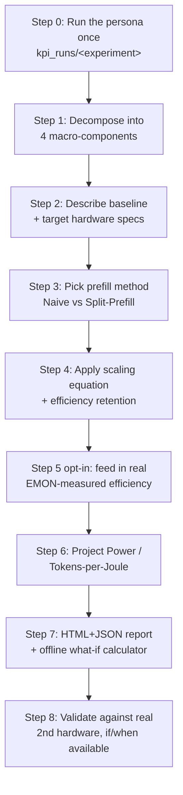

<!-- Marp-compatible slide deck (VS Code "Marp for VS Code" extension renders/exports this to
PDF/PPTX directly). Condensed from docs/ROOFLINE_HW_PROJECTION_METHODOLOGY.md — that doc remains
the canonical, fully-detailed reference; this deck is the "explain it in a meeting" version. -->

# Roofline Hardware Projection
### From a new Agentic AI persona → Wall-Time(s), Tokens/s/TTFT/ITL, and Power on **future hardware**

`tools/roofline_projection/` + `tools/run_roofline_projection.py`

---

## The question we're answering

A new **Agentic AI Workflow persona** lands on the team (e.g. a new agent scenario, a new model,
a new tool mix). Leadership asks:

> "How would this run — Wall Time, Tokens/s, TTFT/ITL, and Power/Tokens-per-Joule —
> on **hardware we don't have yet**?"

We don't have the future chip. We do have **one real measured run** on today's hardware.

---

## The one-line answer

> Run the persona **once**, for real, on today's hardware →
> decompose its timeline into **4 physically-distinct buckets** →
> scale **each bucket** by the resource ratio that actually governs it →
> sum back up.

**Not** one flat multiplier. **Not** a spec-sheet guess. An evidence-anchored projection.

---

## Pipeline at a glance



---

## Step 0 — Get one real baseline run

**What**: Run the new persona's workflow for real (`tools/run_kpi_preset.py`, or a purpose-built
`tools/roofline_calibration/` preset) → produces `kpi_runs/<experiment>/{workflow_kpi.json,
experiment.json, hw_samples.csv}`.

**Why this way**: The whole method is *empirically anchored* — every number downstream is a
**ratio applied to this one real measured timeline**, not a from-scratch analytical estimate.

**Likely question — "Can't we just estimate from spec sheets alone?"**
No tool in this repo does that, on purpose. Real workloads have a real bottleneck mix
(tool-exec gaps, fixed overhead, per-token decode cost) that a datasheet alone can't tell you.

---

## Step 1 — Decompose into 4 macro-components

| Component | Bound by | Scales with |
|---|---|---|
| **Prefill** | Compute (batched GEMMs) | NPU MACs×freq or iGPU XeCores×freq |
| **Decode** | Memory bandwidth | Channels × width × transfer rate |
| **Tool execution** | CPU (Amdahl) | Cores × freq, partly parallel |
| **Stage/harness overhead** | Software stack | Nothing — constant |

**Why**: A single "GPU is 2× faster so wall time is halved" multiplier over- or under-credits
whichever resource actually dominates a given stage.

**Likely question — "Does a new persona need new instrumentation?"**
No — pure arithmetic on fields already logged (`ttft_s`, `avg_itl_ms`, `output_tokens`,
timestamps). Any persona that goes through the standard harness logging works immediately.

---

## Step 2 — Describe baseline & target hardware

**What**: Two small JSON files (`SystemSpec`): CPU cores/freq, iGPU XeCores/freq, NPU MACs/freq,
memory channels/width/transfer-rate.

**Why this way**: Every projection only ever uses a **ratio** between baseline and target spec —
this self-cancels any unverified absolute FLOPs/s constant. We don't need to know the *true*
physical peak, only that both specs use the same proxy consistently.

**Likely question — "Can we auto-detect these?"**
Only CPU core count and memory topology (`Get-CimInstance`). iGPU XeCore count / NPU MAC count
must come from a datasheet — not measurable by this benchmark's tooling today.

---

## Step 3 — Pick a prefill method

| | **Naive Method** (default) | **Split-Prefill Method** |
|---|---|---|
| Assumption | Prefill is 100% compute-bound | Prefill has a real compute **and** memory-bound part |
| Data source | This repo's own `SystemSpec` ratio | Borrowed external per-context-length TTFT curve |
| Current real-world error | **+19.2%** (best validated) | +24.6% |

**Why two methods exist**: real telemetry shows prefill efficiency *does* degrade at long
context (not 100% compute-bound) — but building a fully first-party compute/memory split needs
raw counters this repo's tooling doesn't expose yet (see Step 8 / roadmap).

**Likely question — "Which one do I use for a new persona?"**
Default to **Naive** — it's currently the more accurate of the two against the one real
hardware cross-check we have.

---

## Step 4 — Apply the scaling equation

$$\text{WallTime}(s)=\sum_{i}\left[\frac{\text{Prefill}_i}{E_c}+\frac{\text{Decode}_i}{E_m}+\frac{\text{ToolExec}_i}{E_{cpu}}+\text{Overhead}_i\right]+\text{Overhead}_{fixed}$$

$$E_{domain}=1+\left(\text{raw capability ratio}-1\right)\times\text{retention}\ (\text{default }0.85)$$

**Why Amdahl's law for tool-exec specifically**: `git apply`/`pytest`/file IO are only *partly*
parallelizable — process spawn/disk IO doesn't speed up just because there are more cores.

**Likely question — "Why not just apply the raw hardware ratio directly?"**
Real systems never achieve their full theoretical ratio at scale (NUMA, contention, driver
overhead) — `retention` damps the ideal ratio toward what's realistically achievable.

---

## Step 5 (opt-in) — Feed in real measured efficiency instead of guessing

**What**: `--use-measured-compute-efficiency` / `--use-measured-memory-efficiency` replace the
flat `0.85` guess with **this baseline's own real EMON-measured** busy%/achieved-bandwidth.

**Why**: A flat guess can be badly wrong for a specific real machine — one real case: measured
memory efficiency was 44.9% of peak, not 85%, because of a real DRAM row-buffer-locality effect.

**Likely question — "Does this make the projection exact?"**
No. On the one real ground-truth check available, it cut the Naive Method's error from
**+69.6% → +19.2%** — a big, real improvement, but still not proof of correctness.

---

## Step 6 — Project Power & Tokens/Joule

**What**: Same ratio idea applied to RAPL `cpu`/`igpu`/`npu`/`soc` watts, with two safeguards:
- `--use-duty-cycle-power`: an idle/non-bottleneck domain doesn't get the full capability-ratio
  power bump (fixes a confirmed real over-scaling bug).
- `--power-budget-w` on a target spec: warns if projected power exceeds a real TDP ceiling
  (this model has **no thermal-limit awareness** on its own).

**Likely question — "Is this the same Tokens/Joule as our official MLPerf Power submission?"**
**No.** That's a certified external power-meter measurement (`tools/power/`, trapezoidal
integration of real instantaneous watts). This is an internal-RAPL-telemetry **estimate** —
useful directionally, never quote it as a submission-grade number.

---

## Step 7 — Get the outputs (no new code required)

```powershell
.venv\Scripts\python.exe tools\run_roofline_projection.py `
    --run kpi_runs\<new_persona_run> `
    --baseline-spec data\configs\roofline_targets\<your_real_baseline>.json `
    --target-spec data\configs\roofline_targets\<future_hw_spec>.json `
    --use-measured-compute-efficiency --use-measured-memory-efficiency --use-duty-cycle-power `
    --what-if
```

Produces: an HTML+JSON report (summary cards, spec table, stacked-bar chart) **and** a
standalone offline `what_if_calculator.html` (dropdowns/sliders — no server, no re-running Python).

**Likely question — "Do I need to write code for a brand-new persona?"**
No — one CLI command + two small JSON spec files, once a real baseline run exists (Step 0).

---

## Step 8 — Validate whenever real second hardware shows up

**What we did once**: a real second machine (`JF04WVAW0381-TA`) became available — we predicted
its wall time *before* seeing its real result, then checked.

**What that caught**: the EU-count×frequency "capability" proxy was off by **~15×** in direction
on that real pair, and a borrowed external ratio came from a confounded reference machine —
neither would have been found by code review alone.

**Likely question — "How do we know to trust a projection before a 2nd machine exists?"**
We don't, fully. Treat every projection as **directional** until cross-checked — that's why
every result in this pipeline is labeled with its known error margin, not presented as exact.

---

## Honest state today

| Method | Flat retention error | With Step 5 (EMON-informed) |
|---|---|---|
| Naive | +69.6% | **+19.2%** (best today) |
| Split-Prefill | +31.0% | +24.6% |

- **+19% is our best validated real-world error today** — good enough for relative
  comparisons ("Option A vs Option B"), not for a guaranteed absolute SLA number.
- A full, prioritized list of what would close this gap further lives in
  `docs/ROOFLINE_HW_PROJECTION_METHODOLOGY.md` §11 (Roadmap).

---

## The pipeline, one sentence per step

0. **Run the persona once, for real** → anchors everything in real measured behavior.
1. **Decompose into 4 buckets** (prefill / decode / tool-exec / overhead) → each scales differently.
2. **Describe baseline + target hardware** as ratios → no unverified absolute constants needed.
3. **Pick Naive or Split-Prefill** for the prefill term → Naive by default today.
4. **Apply the scaling equation** with efficiency retention → real systems ≠ ideal ratios.
5. *(opt-in)* **Feed in real measured efficiency** → replaces a guess with this machine's own evidence.
6. **Project Power/Tokens-per-Joule** → with duty-cycle + power-budget safeguards.
7. **Get an HTML report + offline what-if calculator** → zero new code per persona.
8. **Validate against real 2nd hardware** whenever it exists → keeps the whole pipeline honest.

---

## Where to go for more detail

- **Full methodology, equations, every worked example**: `docs/ROOFLINE_HW_PROJECTION_METHODOLOGY.md`
- **Reusable named projection presets** (persona → target → command → last real output):
  `docs/ROOFLINE_PROJECTION_PRESETS.md`
- **What's left to do to improve accuracy further**: `docs/ROOFLINE_HW_PROJECTION_METHODOLOGY.md` §11

**One-line takeaway for any audience**: *this pipeline gives a real, evidence-anchored, honestly
error-bounded answer fast — use it to compare hardware options directionally, and validate with
real hardware before treating any single number as final.*
